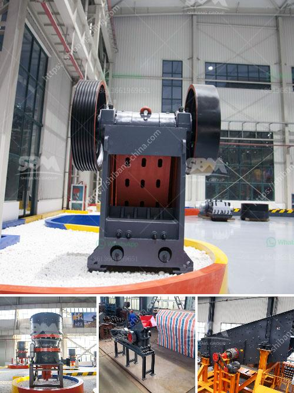

<h3>vertical mills for sale alberta</h3>
Are you in the market for a vertical mill in Alberta? Look no further as we delve into the world of vertical mills for sale and explore their advantages and available options.

Vertical mills, also known as vertical machining centers, are widely used in various industries such as manufacturing, aerospace, automotive, and more. They are highly efficient machines that allow for precision cutting, drilling, and shaping of solid materials. These mills are known for their versatility, making them an essential tool in any workshop.

One of the main advantages of vertical mills is their ability to perform multi-axis machining. By utilizing several axes, including X, Y, and Z, these mills can produce complex shapes and contours with high accuracy. This makes them ideal for tasks that require intricate designs and tight tolerances.

When searching for vertical mills for sale in Alberta, it's important to consider your specific needs and requirements. Different mills come with various features, capabilities, and sizes to suit different applications. Factors such as table size, spindle speed, horsepower, and control system should be considered to ensure the mill meets your production demands.

In Alberta, there are numerous options available for purchasing vertical mills. Local machinery dealers, both online and offline, offer a wide range of new and used mills to suit different budgets. Additionally, auctions and classified ads are reliable sources for finding quality vertical mills at competitive prices.

Before making a purchase, it is recommended to thoroughly research the seller's reputation and read customer reviews. It's also prudent to inspect the machine in person or request a video demonstration to ensure its working condition and verify its specifications.

Whether you are a small shop owner or a large manufacturing facility, investing in a vertical mill in Alberta can significantly enhance your productivity and efficiency. The versatility, precision, and reliability of these machines can help you tackle a wide range of tasks with ease.

In conclusion, the availability of vertical mills for sale in Alberta offers businesses an opportunity to level up their machining capabilities. With careful consideration and research, finding the perfect vertical mill to meet your production needs will be a breeze.
<h3>Contact us</h3><ul><li><strong>Whatsapp:&nbsp;<a href="https://wa.me/8613661969651">+8613661969651</a></strong></li><li><a href="https://swt.shibang-china.com/?git&amp;zhl&amp;vertical mills for sale alberta"><strong>Online Service(chat now)</strong></a></li></ul><h3>Related</h3><ul><li><a href='used mini grinding plant india sale.md'>used mini grinding plant india sale</a></li><li><a href='used nd hand coal crusher sizer.md'>used nd hand coal crusher sizer</a></li><li><a href='raymond used mill for sale.md'>raymond used mill for sale</a></li><li><a href='pulverizer crusher manufacturers ppt.md'>pulverizer crusher manufacturers ppt</a></li><li><a href='stone crusher permission maharashtra.md'>stone crusher permission maharashtra</a></li></ul>