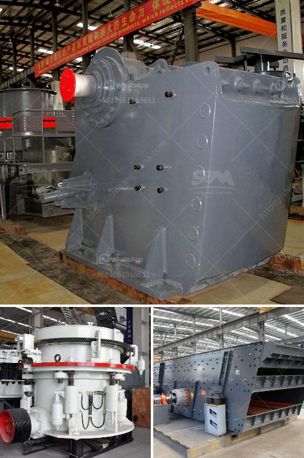

<h3>vertical roller mill animation gif</h3>
The vertical roller mill (VRM) is a key piece of equipment in the cement and mining industry. It allows grinding of various materials, such as cement, coal, limestone, fly ash, slag, and minerals. However, the VRM operation is not as simple as grinding conventional materials; it requires deep knowledge and expertise. To assist in comprehending the complex machinery, the use of animation GIFs proves to be invaluable.

The VRM animation GIF reveals the structure of the grinding table and rollers. These crucial components work together to bring about the grinding process. The material to be ground falls onto the grinding table, where it is crushed and ground by the rollers. The GIF unravels the synchronized movement of the grinding table and rollers, allowing viewers to comprehend its intricate functionality.

Understanding the VRM's hydraulic system is vital for smooth operation. Animation GIFs play a crucial role in visualizing the system's complexity. They demonstrate the movement of hydraulic cylinders and pistons, showcasing how pressure is applied to maintain the desired grinding pressure and ensure optimal performance.

The separator and fan are instrumental in delivering finished products while removing excess particles. Animation GIFs help depict how the separator works, separating the ground material from the airflow. They also highlight the role of fans in creating proper airflow and ensuring the circulation of materials within the VRM system.

Animation GIFs effectively simplify the complex machinery involved in VRM. By depicting the movement of various components and their interactions, they make it easier for learners to grasp the VRM's working principles.

Animated visuals have a lasting impact on memory retention and comprehension. By watching the GIFs repeatedly, learners reinforce their understanding, ensuring long-term retention of the VRM's operational processes.

Interactive learning experiences improve engagement and knowledge retention. By offering GIFs, learners can pause, rewind, and study individual components at their own pace. This interactive approach encourages active learning and promotes a deeper understanding of VRM operations.

The integration of animation GIFs in training materials allows for a more comprehensive understanding of the vertical roller mill's complex operations. These engaging visuals simplify the comprehension of critical components like grinding tables, rollers, hydraulic systems, separators, and fans. By employing animated GIFs, learners can grasp the VRM operation's intricacy, leading to enhanced retention and better-equipped professionals in the cement and mining industry. So, for anyone seeking to delve into the world of VRM, animation GIFs provide an immersive and effective learning experience.
<h3>Contact us</h3><ul><li><strong>Whatsapp:&nbsp;<a href="https://wa.me/8613661969651">+8613661969651</a></strong></li><li><a href="https://swt.shibang-china.com/?git&amp;zhl&amp;vertical roller mill animation gif"><strong>Online Service(chat now)</strong></a></li></ul><h3>Related</h3><ul><li><a href='quarry business in nigeria.md'>quarry business in nigeria</a></li><li><a href='portable concrete crusher.md'>portable concrete crusher</a></li><li><a href='limestone processing plant price.md'>limestone processing plant price</a></li><li><a href='stone crusher portable machine.md'>stone crusher portable machine</a></li><li><a href='limestone processing plant supplier.md'>limestone processing plant supplier</a></li></ul>