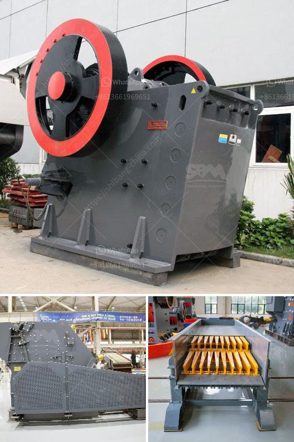

<h3>vertical roller mill gearboxes</h3>
Vertical roller mill gearboxes are widely used in the cement industry due to their strong grinding capabilities and high efficiency. With the increasing demand for efficient cement production, the importance of these gearboxes is also growing.

Vertical roller mills (VRM) have been a popular choice for raw materials and cement grinding for many years. The VRM technology offers several benefits over traditional ball mills, such as higher energy efficiency, lower power consumption, and a smaller footprint. However, the operation of VRMs requires high torque and reliable gearboxes to withstand the extreme conditions of the grinding process.

Gearboxes used in VRMs are designed to handle large amounts of power and torque, while ensuring smooth and precise operation. They are usually constructed with high-strength materials, such as hardened alloy steel, and undergo rigorous testing to ensure their durability and reliability.

One notable feature of vertical roller mill gearboxes is their compact design. This allows them to be easily integrated into existing mill installations without requiring significant modifications. The compactness also helps in reducing the overall size and weight of the gearboxes, resulting in cost savings during transportation and installation.

Another key aspect of VRM gearboxes is their efficient lubrication system. The gearboxes are equipped with advanced oil circulation systems, ensuring constant lubrication and cooling of the gears. This eliminates the need for additional external lubrication units and reduces maintenance requirements.

In addition to their robustness and efficiency, vertical roller mill gearboxes also offer high availability and long service life. Regular maintenance and inspection are crucial to ensure optimal performance and prevent unexpected downtime.

Overall, vertical roller mill gearboxes play a critical role in the cement industry, enabling efficient and reliable grinding of raw materials and cement. Manufacturers continue to innovate and improve gearboxes to meet the ever-increasing demands of the industry, ensuring the smooth operation of vertical roller mills.
<h3>Contact us</h3><ul><li><strong>Whatsapp:&nbsp;<a href="https://wa.me/8613661969651">+8613661969651</a></strong></li><li><a href="https://swt.shibang-china.com/?git&amp;zhl&amp;vertical roller mill gearboxes"><strong>Online Service(chat now)</strong></a></li></ul><h3>Related</h3><ul><li><a href='gypsum crushing making machine south africa.md'>gypsum crushing making machine south africa</a></li><li><a href='high speed limestone milling machine.md'>high speed limestone milling machine</a></li><li><a href='iron ore mining and beneficiation project.md'>iron ore mining and beneficiation project</a></li><li><a href='bauxite mining machine.md'>bauxite mining machine</a></li><li><a href='second hand crushers and screens in south africa.md'>second hand crushers and screens in south africa</a></li></ul>