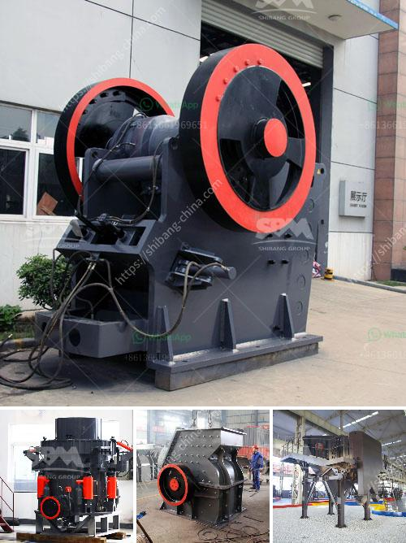

<h3>vertical shaft crusher</h3>
A vertical shaft crusher is useful in various industries including mining, construction, and recycling. It is a versatile machine that takes in hard rock materials and turns them into smaller, more manageable sizes. With its unique design, it offers an efficient and cost-effective solution for processing various types of materials.

One of the main advantages of a vertical shaft crusher is its ability to produce cubical-shaped end products. Unlike traditional impact crushers, which tend to produce flatter and elongated particles, a vertical shaft crusher produces a more uniform shape. This is highly desirable in many applications, such as concrete production, where cubical-shaped aggregates are preferred. The cubical shape also improves the quality of the end product for use in asphalt and other construction materials.

The vertical shaft crusher operates by throwing the materials against hard surfaces, such as high-speed rotors or anvils, which effectively break them down into smaller sizes. The materials are fed into the crusher through a port on the top or side of the machine. They are then accelerated by the internal mechanism and tossed against the crushing chamber's walls or anvils.

Another benefit of the vertical shaft crusher is its energy efficiency. Compared to other types of crushers, such as jaw or cone crushers, a vertical shaft crusher consumes less power and produces fewer fines. This makes it an environmentally friendly option for reducing energy consumption and emissions. Additionally, the crusher's lightweight design and compact footprint make it easy to transport and maneuver on construction sites.

Maintenance and operation of a vertical shaft crusher are relatively simple. The machine is designed with easily accessible components, making it convenient to inspect and replace worn parts. Regular maintenance, such as lubrication and cleaning, helps prolong the machine's lifespan and ensures optimal performance. Additionally, most vertical shaft crushers are equipped with safety features, such as a hydraulic system to prevent damage caused by overloading or tramp iron.

When considering a vertical shaft crusher, it is essential to evaluate its capacity and performance. Factors such as the type and hardness of the material being processed, the required product size, and the desired throughput should be taken into account. It is advisable to consult with experts or manufacturers to determine the most suitable model for specific applications.

In conclusion, a vertical shaft crusher is a valuable machine in various industries. Its ability to produce cubical-shaped end products, energy efficiency, and ease of operation and maintenance make it an attractive option for processing hard rock materials. Whether in mining, construction, or recycling, a vertical shaft crusher offers an efficient and cost-effective solution for reducing oversized materials into smaller sizes.
<h3>Contact us</h3><ul><li><strong>Whatsapp:&nbsp;<a href="https://wa.me/8613661969651">+8613661969651</a></strong></li><li><a href="https://swt.shibang-china.com/?git&amp;zhl&amp;vertical shaft crusher"><strong>Online Service(chat now)</strong></a></li></ul><h3>Related</h3><ul><li><a href='malaysia coconut grinder machine.md'>malaysia coconut grinder machine</a></li><li><a href='types of crushers ppt.md'>types of crushers ppt</a></li><li><a href='hammer mills hammer mills.md'>hammer mills hammer mills</a></li><li><a href='limestone primary crushing plant.md'>limestone primary crushing plant</a></li><li><a href='famous manganese cone crusher parts made china.md'>famous manganese cone crusher parts made china</a></li></ul>