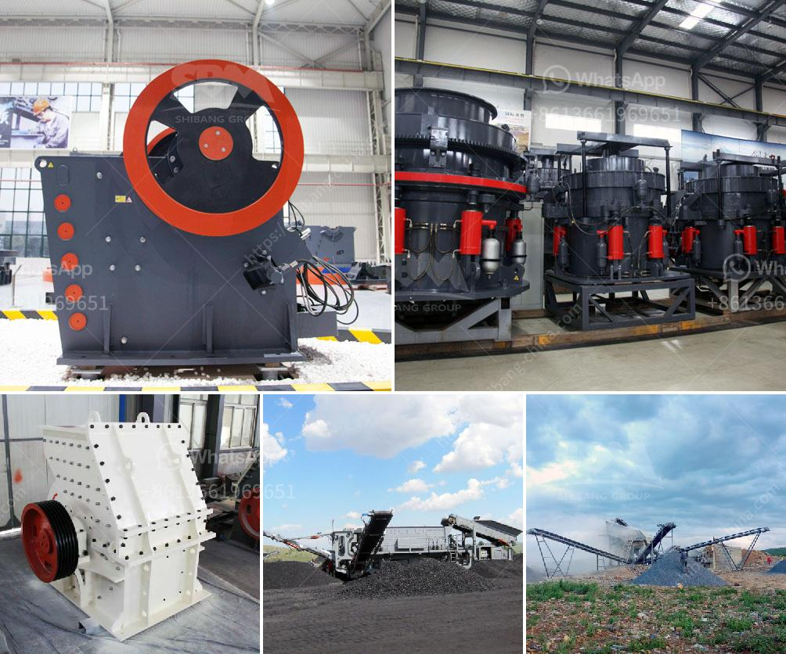

<h3>vertical shaft impact crusher plf</h3>
Vertical shaft impact crusher is commonly known as sand making machine and shaper. These sand making machines are equipped with an efficient and highly productive crushing chamber that ensures they offer highly efficient crushing results. Vertical shaft impact crusher PLF is often used for producing high-quality aggregates for use in various construction applications, such as highways, railways, bridges, airports, and many others.

One of the key benefits of using a vertical shaft impact crusher PLF is its ability to produce a wide range of differently sized products. Unlike other types of crushers, such as jaw crushers or cone crushers, vertical shaft impact crushers can be adjusted to create different-sized products by changing the rotor speed, feed rate, and crushing chamber configuration. This versatility allows users to easily produce aggregates of different sizes, which can be used for various applications.

Another advantage of using a vertical shaft impact crusher PLF is its ability to produce highly cubical-shaped aggregates. The crushing chamber of these machines is carefully designed to ensure the aggregates are crushed in a way that produces a high percentage of cubical-shaped particles. This is important because cubical-shaped aggregates offer better interlocking properties, which result in stronger and more durable concrete and asphalt mixes. In addition, cubical-shaped aggregates are also preferred in many architectural and decorative applications.

Vertical shaft impact crusher PLF is also known for its low operating cost. These machines are designed to operate with minimum wear and tear, which translates into lower maintenance and operating costs. Additionally, the efficient crushing chamber design of these machines ensures that energy consumption is kept to a minimum. This results in lower electricity costs for operators.

Furthermore, vertical shaft impact crusher PLF is equipped with advanced automation features. These features allow for remote monitoring and control of the crusher's operations, which improves operator safety and productivity. Automation also helps reduce the risk of human error, ensuring consistent and accurate product quality.

In conclusion, vertical shaft impact crusher PLF is a highly efficient and versatile crushing machine that is used in a wide range of construction applications. Its ability to produce differently sized and highly cubical-shaped aggregates makes it suitable for various projects. Moreover, its low operating cost and advanced automation features make it a cost-effective and user-friendly choice for operators. Overall, vertical shaft impact crusher PLF offers significant benefits in terms of product quality, versatility, and operational efficiency.
<h3>Contact us</h3><ul><li><strong>Whatsapp:&nbsp;<a href="https://wa.me/8613661969651">+8613661969651</a></strong></li><li><a href="https://swt.shibang-china.com/?git&amp;zhl&amp;vertical shaft impact crusher plf"><strong>Online Service(chat now)</strong></a></li></ul><h3>Related</h3><ul><li><a href='mantencion a cone crusher.md'>mantencion a cone crusher</a></li><li><a href='ball mill for size reduction.md'>ball mill for size reduction</a></li><li><a href='utiliza equipos de molienda fina molino.md'>utiliza equipos de molienda fina molino</a></li><li><a href='pulverizer crusher manufacturers ppt.md'>pulverizer crusher manufacturers ppt</a></li><li><a href='stone crusher machine price in kenya.md'>stone crusher machine price in kenya</a></li></ul>