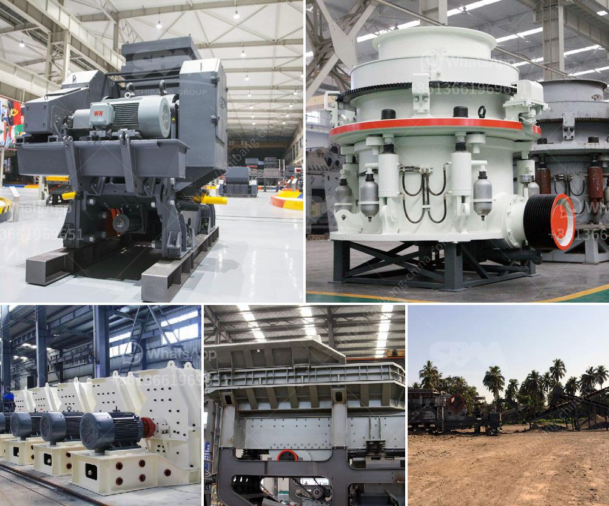

<h3>vertical vertical grinding machine</h3>
Vertical grinding machines are an essential part of the metalworking industry. These machines enable operators to perform precision grinding tasks on different types of materials, such as metal and plastic. With their ability to provide a high level of accuracy and surface finish, vertical grinding machines are in high demand for various industrial applications.

One of the key advantages of using a vertical grinding machine is its ability to provide optimal stability during the grinding process. Unlike horizontal grinding machines that can experience vibration and instability, vertical machines have a more rigid and stable construction. This ensures that the grinding wheel remains parallel to the work surface, resulting in consistent and accurate results.

Another advantage of vertical grinding machines is their versatility. These machines can be used for both rough and fine grinding operations, making them suitable for a wide range of applications. Whether operators need to remove material at a fast rate or achieve a smooth surface finish, vertical grinding machines can handle various grinding requirements.

Vertical grinding machines also offer improved access to the workpiece compared to horizontal machines. With a vertical design, operators can easily reach the workpiece and make adjustments without the need for additional tools or complicated setups. This accessibility contributes to enhanced productivity and smoother workflow.

Furthermore, vertical grinding machines are known for their space-saving design. These machines have a smaller footprint compared to their horizontal counterparts, making them ideal for industries with limited floor space. This compact design also allows for easier integration into existing production lines, enabling manufacturers to optimize their operations without major layout changes.

One of the standout features of vertical grinding machines is their exceptional precision. These machines incorporate advanced technology, including accurate measuring systems and precise positioning capabilities. With their high level of control, operators can achieve tight tolerances and ensure consistent results even when dealing with complex geometries.

Additionally, vertical grinding machines often come equipped with automatic tool changers and other advanced features. These features streamline the grinding process, reduce setup times, and improve overall efficiency. With automatic tool changers, operators can easily switch between different grinding tools, saving time and resources.

In conclusion, vertical grinding machines play a crucial role in the metalworking industry. Their stability, versatility, and precision make them indispensable for a wide range of grinding applications. Whether it's removing material or achieving a smooth surface finish, these machines deliver consistent and accurate results. With their space-saving design and advanced features, vertical grinding machines offer improved productivity and efficiency for manufacturers.
<h3>Contact us</h3><ul><li><strong>Whatsapp:&nbsp;<a href="https://wa.me/8613661969651">+8613661969651</a></strong></li><li><a href="https://swt.shibang-china.com/?git&amp;zhl&amp;vertical vertical grinding machine"><strong>Online Service(chat now)</strong></a></li></ul><h3>Related</h3><ul><li><a href='coal crushing machine in malaysia.md'>coal crushing machine in malaysia</a></li><li><a href='gold mill for sale in zimbabwe.md'>gold mill for sale in zimbabwe</a></li><li><a href='ball mill for sale in india.md'>ball mill for sale in india</a></li><li><a href='rental of crusher in malaysia.md'>rental of crusher in malaysia</a></li><li><a href='manufacturers hammer mill manufacturers in malaysia.md'>manufacturers hammer mill manufacturers in malaysia</a></li></ul>