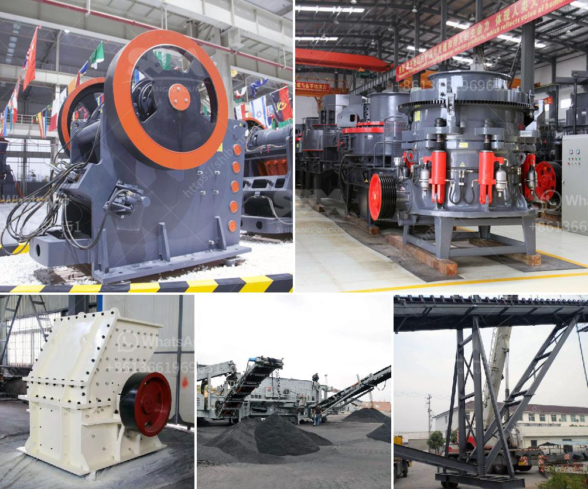

<h3>vibrating feeders operating parameters from zenith china</h3>
Vibrating feeders are widely used in the mining and construction industries to transport and handle bulk materials. They play a crucial role in ensuring a continuous flow of materials to various processing equipment. Zenith China, a leading manufacturer of mining and construction equipment, offers vibrating feeders that are known for their high efficiency and reliability.

The operating parameters of vibrating feeders from Zenith China are carefully designed to ensure optimal performance. These parameters include the feed capacity, feeding speed, and amplitude.

The feed capacity of a vibrating feeder determines how much material it can handle in a given time. Zenith China's vibrating feeders are designed to have a high feed capacity, allowing for efficient and continuous material flow. This is particularly important in applications where a large volume of material needs to be processed.

The feeding speed of a vibrating feeder also affects its performance. Zenith China's vibrating feeders are designed to have an adjustable feeding speed, allowing operators to control the flow rate of materials. This enables precise and accurate feeding, ensuring that the downstream processing equipment receives a consistent and controlled material flow.

The amplitude of vibration is another important parameter of vibrating feeders. Zenith China's vibrating feeders are designed to have an adjustable amplitude, allowing operators to optimize the movement of materials. A larger amplitude can promote the loosening and stratification of materials, while a smaller amplitude can help prevent the material from bouncing, thus ensuring smooth and efficient material flow.

In addition to these operating parameters, Zenith China's vibrating feeders also feature a robust and durable construction. They are built to withstand the challenging conditions of mining and construction sites, ensuring long-term reliability and minimal maintenance requirements.

In conclusion, vibrating feeders from Zenith China offer a range of operating parameters that are carefully designed to ensure efficient and reliable material handling. With high feed capacity, adjustable feeding speed, and adjustable amplitude, these vibrating feeders can effectively transport and handle bulk materials in various mining and construction applications.
<h3>Contact us</h3><ul><li><strong>Whatsapp:&nbsp;<a href="https://wa.me/8613661969651">+8613661969651</a></strong></li><li><a href="https://swt.shibang-china.com/?git&amp;zhl&amp;vibrating feeders operating parameters from zenith china"><strong>Online Service(chat now)</strong></a></li></ul><h3>Related</h3><ul><li><a href='roller mill corrugation.md'>roller mill corrugation</a></li><li><a href='vertical mills for sale alberta.md'>vertical mills for sale alberta</a></li><li><a href='captains of crusher zenith.md'>captains of crusher zenith</a></li><li><a href='conveyor belt hire ireland.md'>conveyor belt hire ireland</a></li><li><a href='200mm crusher sieve opening sizes.md'>200mm crusher sieve opening sizes</a></li></ul>