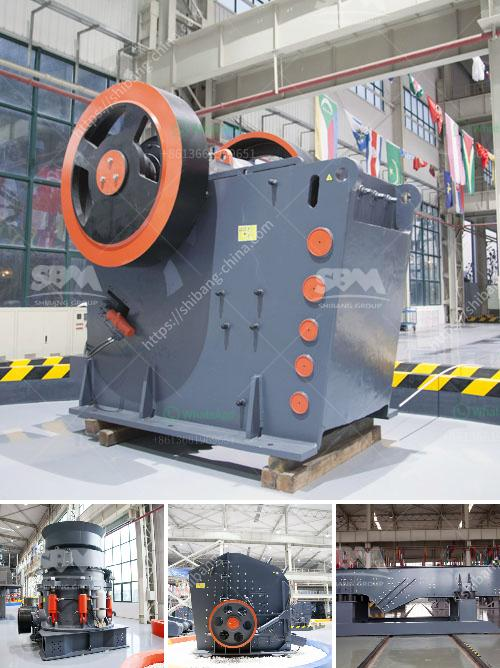

<h3>vibrating grinding mill ball china</h3>
In recent years, the mining industry has witnessed tremendous advancements in technology, particularly in the area of grinding mills. Among the notable developments is the introduction of vibrating grinding mill balls in China, which has revolutionized the process of reducing ore particles to finer sizes. This article will explore the key features and benefits of vibrating grinding mill balls, along with their impact on the mining industry in China.

The traditional static grinding mill balls have limitations in terms of efficiency and productivity. However, the introduction of vibrating grinding mill balls has transformed this process, making it more efficient and productive. These balls are designed to vibrate, ensuring the particles inside the mill are constantly colliding with one another and the mill walls. This movement generates more impact and shear forces, enabling faster and more effective grinding of the ore particles.

Another significant advantage of vibrating grinding mill balls is their ability to achieve a finer and more consistent particle size distribution. The vibrating motion ensures that the ore particles are uniformly exposed to the grinding media, resulting in a more homogeneous product. This narrower particle size distribution enhances the efficiency of subsequent processing steps, such as flotation or cyanidation, leading to improved overall recovery rates.

With their unique vibrating motion, these grinding mill balls require less energy compared to traditional static balls. The increased frequency of particle collisions and the reduced reliance on centrifugal forces translate into lower energy consumption during grinding operations. Moreover, the reduced wear on the mill liners and the grinding media results in longer component lifespans, reducing maintenance costs and downtime.

The adoption of vibrating grinding mill balls also brings environmental advantages to the mining industry. The reduced energy consumption directly translates into lower greenhouse gas emissions, contributing to a more sustainable mining process. Additionally, the finer particle sizes generated through vibrating grinding mill balls enable better liberation of valuable minerals, reducing the need for harmful chemicals used in subsequent mineral processing steps.

China is the world's leading producer and consumer of various metals, making its mining industry a significant contributor to the country's economy. As the demand for minerals continues to grow, it has become crucial for China to embrace innovative technologies that increase productivity and efficiency while reducing environmental impacts. The adoption of vibrating grinding mill balls aligns with China's commitment to sustainable mining practices and positions the country as a global leader in technological advancements in the mining sector.

The introduction of vibrating grinding mill balls has revolutionized the mining industry in China, unlocking numerous benefits that were previously unattainable with traditional static grinding media. From enhanced grinding efficiency to improved particle size distribution, this technology has reshaped the way ore processing is conducted. Not only does it increase productivity, but it also reduces energy consumption, wear, and environmental impacts. As China continues to strive for sustainable mining practices, vibrating grinding mill balls highlight the country's commitment to technological advancements and set the stage for a more efficient and environmentally friendly mining future.
<h3>Contact us</h3><ul><li><strong>Whatsapp:&nbsp;<a href="https://wa.me/8613661969651">+8613661969651</a></strong></li><li><a href="https://swt.shibang-china.com/?git&amp;zhl&amp;vibrating grinding mill ball china"><strong>Online Service(chat now)</strong></a></li></ul><h3>Related</h3><ul><li><a href='crusher machine price in sri lanka.md'>crusher machine price in sri lanka</a></li><li><a href='ball mill for pigment.md'>ball mill for pigment</a></li><li><a href='crsusher plant in the philippines.md'>crsusher plant in the philippines</a></li><li><a href='mining heavy equipment price list.md'>mining heavy equipment price list</a></li><li><a href='ultrafine vertical roller mill.md'>ultrafine vertical roller mill</a></li></ul>