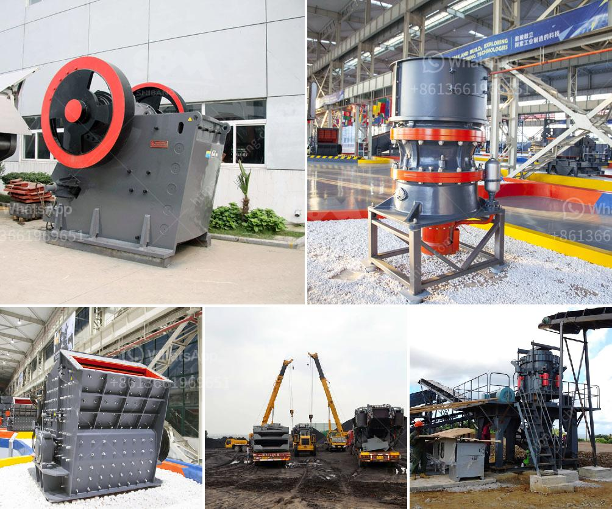

<h3>vibrating screen in the philippines</h3>
In the field of mining and quarrying, the vibrating screen is one of the most essential pieces of equipment for separating larger rocks and gravel from smaller stones. The Philippines, in particular, has a rich mining and quarrying industry which significantly contributes to its economic growth. And in this sector, the vibrating screen plays a crucial role.

A vibrating screen, also known as a sieve or separator, is utilized to separate materials based on their sizes. It works by shaking the screen in an upward and downward motion, causing the materials to move across the screen and ultimately become separated into different size fractions. This process is vital in mining and quarrying as it ensures that the extracted materials are properly graded and sorted, ready for further processing or usage.

In the Philippines, the demand for minerals and other natural resources is continuously increasing. The vibrating screen, therefore, becomes an indispensable tool for mining companies and quarry operators. It allows them to efficiently separate different sizes of materials, resulting in a higher quality and more marketable end product.

Moreover, the vibrating screen in the Philippines also finds its application in other industries such as construction and manufacturing. Construction companies use vibrating screens to separate aggregates and construction materials of different sizes, ensuring uniformity in their mixtures. Meanwhile, manufacturers rely on vibrating screens to separate and classify materials during the production process, enabling them to meet specific product quality requirements.

With the continuous growth of mining and quarrying activities in the Philippines, the demand for vibrating screens is expected to rise. This presents an opportunity for local businesses to provide high-quality and reliable vibrating screens to meet the needs of the industry. Investing in advanced vibrating screen technologies can also help improve operational efficiency and reduce downtime, further strengthening the industry's competitiveness in the global market.

In conclusion, the vibrating screen in the Philippines is an essential tool for mining and quarrying operations. Its role in ensuring efficient separation of materials, be it for processing or sale, cannot be overstated. As the demand for minerals and quarry products continues to grow, the vibrating screen stands as a crucial equipment for the industry's sustained growth and success.
<h3>Contact us</h3><ul><li><strong>Whatsapp:&nbsp;<a href="https://wa.me/8613661969651">+8613661969651</a></strong></li><li><a href="https://swt.shibang-china.com/?git&amp;zhl&amp;vibrating screen in the philippines"><strong>Online Service(chat now)</strong></a></li></ul><h3>Related</h3><ul><li><a href='mining of granite companies.md'>mining of granite companies</a></li><li><a href='lavadora de arena en mexico.md'>lavadora de arena en mexico</a></li><li><a href='small grinding machine for limestone.md'>small grinding machine for limestone</a></li><li><a href='list of stone crusher equipment.md'>list of stone crusher equipment</a></li><li><a href='the largest stone crusher system.md'>the largest stone crusher system</a></li></ul>