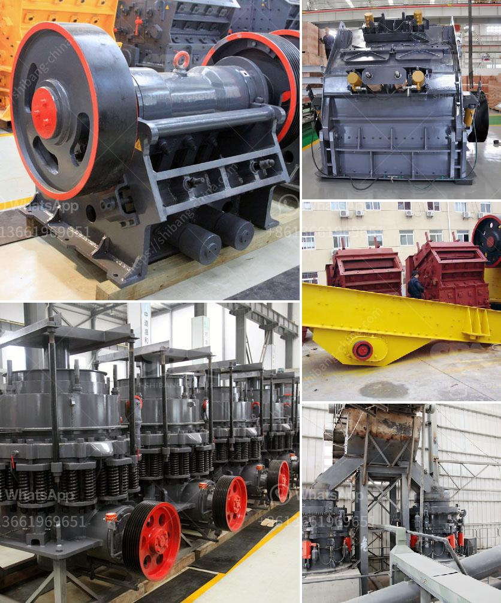

<h3>vibrating screen supplier</h3>
In today's fast-paced industrial world, vibrating screens have become indispensable tools for numerous industries. From mining to pharmaceuticals, these efficient and reliable machines are used to separate and grade materials of different sizes. However, finding a trustworthy vibrating screen supplier can often be a daunting task. With countless options available in the market, it is essential to choose a supplier that can understand your specific requirements and offer a high-quality product tailored to your needs.

One of the key factors to consider when selecting a vibrating screen supplier is their experience and reputation in the industry. Look for suppliers who have been in the business for a considerable amount of time and have a proven track record of delivering top-notch products. A reputable supplier will have a strong customer base and positive reviews that reflect their commitment to excellence.

Quality is another crucial aspect to consider. Ensure that the supplier you choose manufactures their vibrating screens using high-grade materials and advanced technology. The screen should be robust, durable, and capable of withstanding heavy-duty applications. A well-constructed screen will require minimal maintenance and provide reliable operation for an extended period.

Customizability is also an important consideration. Every industry has unique requirements when it comes to vibrating screens. Therefore, opt for a supplier who can provide customized solutions to meet your specific needs. They should have the capability to design and manufacture screens in various sizes, configurations, and materials to accommodate your production requirements.

Additionally, it is essential to choose a supplier who offers excellent after-sales service. Vibrating screens, like any other machinery, may require maintenance or replacement of parts over time. A reliable supplier should provide prompt and efficient support, including spare parts availability and technical assistance. They should also offer warranty periods to ensure customer satisfaction and peace of mind.

Price is undeniably a significant factor when selecting a vibrating screen supplier. However, it is crucial not to compromise on quality for the sake of a lower price. Consider the long-term benefits and return on investment that a high-quality, durable screen can provide. Evaluate the supplier's pricing structure in relation to the quality of their products to make an informed decision.

Lastly, do not forget to assess the supplier's environmental commitment. Look for suppliers who adhere to environmentally friendly practices and use eco-friendly materials whenever possible. Responsible manufacturing not only benefits the environment but also demonstrates the supplier's commitment to sustainable business practices.

In conclusion, the selection of a vibrating screen supplier should be based on various critical factors, including experience, reputation, quality, customizability, after-sales service, price, and environmental commitment. Investing in a reliable and high-quality vibrating screen will ensure optimal performance and productivity for your industry. Taking the time to research and choose the right supplier will undoubtedly yield long-term benefits and contribute to your business's success.
<h3>Contact us</h3><ul><li><strong>Whatsapp:&nbsp;<a href="https://wa.me/8613661969651">+8613661969651</a></strong></li><li><a href="https://swt.shibang-china.com/?git&amp;zhl&amp;vibrating screen supplier"><strong>Online Service(chat now)</strong></a></li></ul><h3>Related</h3><ul><li><a href='proposal on quarry business.md'>proposal on quarry business</a></li><li><a href='used raymond roller mills for sale.md'>used raymond roller mills for sale</a></li><li><a href='gypsum crusher machine turkey.md'>gypsum crusher machine turkey</a></li><li><a href='used clay brick machine for sale in germany.md'>used clay brick machine for sale in germany</a></li><li><a href='ultra fine mill manufacturers in india.md'>ultra fine mill manufacturers in india</a></li></ul>