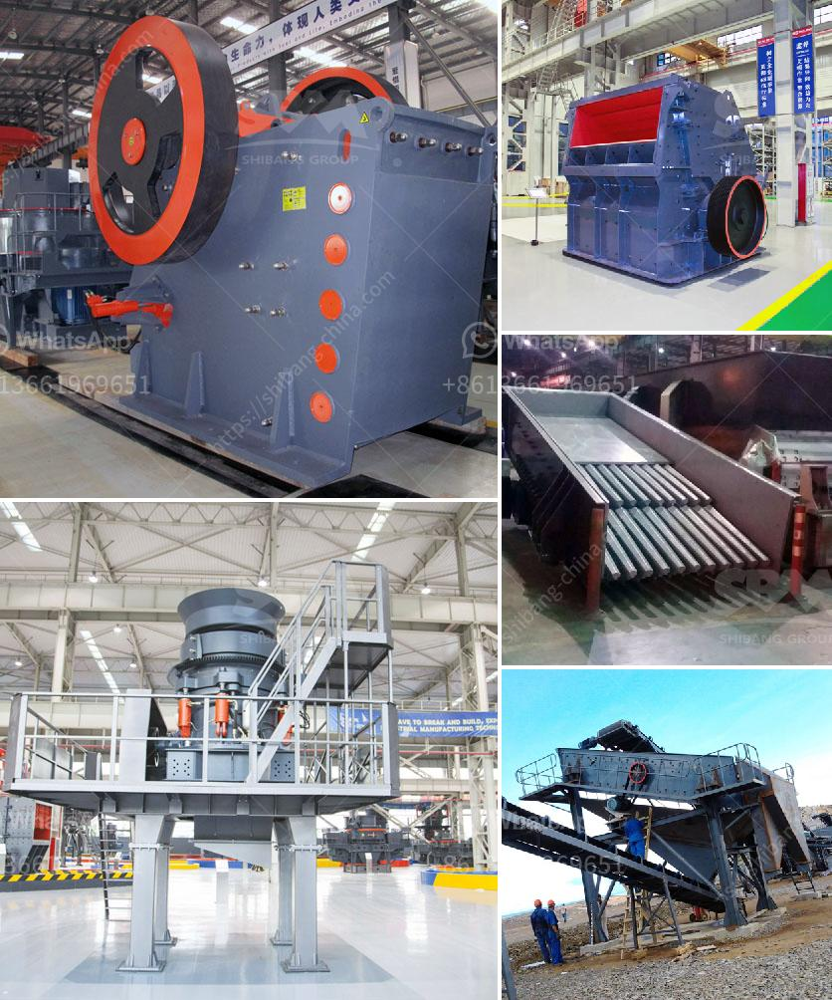

<h3>vibrating screens manufacturers</h3>
Vibrating screens are important equipment in various industries for separating and grading materials based on size. Vibrating screens manufacturers are companies that specialize in designing, manufacturing, and supplying vibrating screens to customers across the globe.

Vibrating screens are widely used in industries such as mining, pharmaceutical, chemical, food, and construction. They are widely used to separate and grade different materials according to their size. The vibrating screen consists of a vibrating motor that causes the screen to vibrate, a screen mesh that sorts and separates the material, and a deck which holds the screen cloth and the drive unit.

Vibrating screens manufacturers typically produce a wide variety of screens in different sizes and configurations to suit various application requirements. Some of the common configurations include single deck, double deck, and triple deck screens. They can also be inclined or horizontal, depending on the application.

One of the leading vibrating screens manufacturers in the industry is Vibramech. They offer a range of high-quality vibrating screens, including horizontal screens, inclined screens, dewatering screens, and grizzly screens. Vibramech screens are known for their durability and low maintenance requirements. They also have a wide range of sizes and configurations to cater to different customer needs.

Another prominent vibrating screens manufacturer is Metso Corporation. Metso's screens come in various sizes and configurations to meet the diverse needs of customers across different industries. Their vibrating screens are known for their robust construction and long lifespan. Metso also offers a range of modular screen panels to improve screening efficiency and reduce downtime.

Haver & Boecker is another well-known manufacturer of vibrating screens. They offer a range of screens for both wet and dry applications, and their innovative design ensures optimal performance and productivity. Haver & Boecker screens are widely used in mining, aggregates, and industrial minerals industries.

Other notable vibrating screens manufacturers include Derrick Corporation and Derrick Equipment Company, both of which offer a wide range of screens for various applications. These companies focus on continuous research and development to improve their products and provide innovative solutions to customers' screening needs.

When choosing a vibrating screen manufacturer, it is important to consider factors such as the quality and durability of the screens, the company's reputation and customer service, and the overall cost-effectiveness. It is also essential to assess the specific requirements of the application and ensure that the chosen manufacturer can provide the right solution.

In conclusion, vibrating screens manufacturers play a crucial role in the industry by providing high-quality equipment that is essential for various industries. Their expertise in designing and manufacturing vibrating screens ensures efficient separation and grading of materials. With a wide variety of sizes and configurations available, customers can find the right vibrating screen for their specific needs.
<h3>Contact us</h3><ul><li><strong>Whatsapp:&nbsp;<a href="https://wa.me/8613661969651">+8613661969651</a></strong></li><li><a href="https://swt.shibang-china.com/?git&amp;zhl&amp;vibrating screens manufacturers"><strong>Online Service(chat now)</strong></a></li></ul><h3>Related</h3><ul><li><a href='stone crusher youtube.md'>stone crusher youtube</a></li><li><a href='roller mill dimensions.md'>roller mill dimensions</a></li><li><a href='want to buy crusher pozzolan.md'>want to buy crusher pozzolan</a></li><li><a href='iron ore crushers.md'>iron ore crushers</a></li><li><a href='crusher unit daily production capacity.md'>crusher unit daily production capacity</a></li></ul>