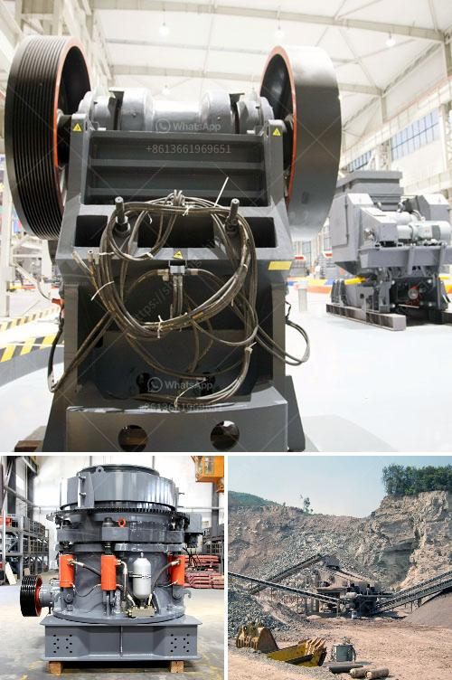

<h3>vibration grinding equipment</h3>
Material processing plays a crucial role in numerous industries, from mining and construction to manufacturing and recycling. One technology that has been gaining significant attention in recent years is vibration grinding equipment. This innovative equipment has revolutionized how materials are ground, resulting in improved efficiency, reduced energy consumption, and enhanced product quality. In this article, we will explore the features and benefits of vibration grinding equipment.

Vibration grinding equipment, also known as vibratory grinding mills or vibratory ball mills, utilizes vibrations to reduce the size of materials through grinding. Unlike traditional grinding methods that rely on impact and friction, vibration grinding equipment applies controlled vibrations to the grinding media, such as balls or rods, in the mill chamber. These vibrations cause the media to collide and grind against the material particles.

One of the key advantages of vibration grinding equipment is its ability to achieve finer and more uniform particle size distribution compared to conventional grinding methods. The controlled vibrations applied to the media enhance the grinding action, ensuring that particles are efficiently pulverized. As a result, vibration grinding equipment can produce materials with a narrower particle size range, improving material consistency and overall product quality.

Another significant benefit of vibration grinding equipment is its energy-efficiency. Traditional grinding methods often involve high energy consumption due to the intense impact and friction between the grinding media and the material. In contrast, vibration grinding equipment relies on mechanical vibrations, requiring less energy input. This results in reduced operating costs for businesses, making it a more sustainable and cost-effective solution.

Furthermore, vibration grinding equipment offers enhanced process control and flexibility. The amplitude and frequency of the vibrations can be adjusted to suit specific material characteristics and desired particle size distribution. This adaptability allows for precise control over the grinding process, ensuring optimal results for a wide range of materials. Additionally, vibration grinding equipment can process both dry and wet materials, further expanding its versatility.

The applications of vibration grinding equipment are diverse and can be found in various industries. In the mining industry, vibration grinding mills are utilized to grind ores to a finer size, which enhances mineral liberation during subsequent mineral separation processes. In the manufacturing industry, vibration grinding equipment can produce fine powders used in ceramics, paints, and pharmaceuticals. Furthermore, the equipment is beneficial in the recycling industry for grinding waste materials into reusable products.

In conclusion, vibration grinding equipment has brought about significant advancements in material processing. Its ability to achieve finer and more uniform particle size distributions, energy efficiency, enhanced process control, and versatility make it an attractive option for businesses across different sectors. The benefits of vibration grinding equipment include improved product quality, reduced operating costs, and increased sustainability. As industries continue to evolve and demand higher quality products, vibration grinding equipment will undoubtedly play a pivotal role in driving innovation in material processing.
<h3>Contact us</h3><ul><li><strong>Whatsapp:&nbsp;<a href="https://wa.me/8613661969651">+8613661969651</a></strong></li><li><a href="https://swt.shibang-china.com/?git&amp;zhl&amp;vibration grinding equipment"><strong>Online Service(chat now)</strong></a></li></ul><h3>Related</h3><ul><li><a href='iron crushing equipment.md'>iron crushing equipment</a></li><li><a href='capacity of the jaw crusher.md'>capacity of the jaw crusher</a></li><li><a href='sample contract mining agreement.md'>sample contract mining agreement</a></li><li><a href='silica processing company.md'>silica processing company</a></li><li><a href='used gupsum board plant sale.md'>used gupsum board plant sale</a></li></ul>