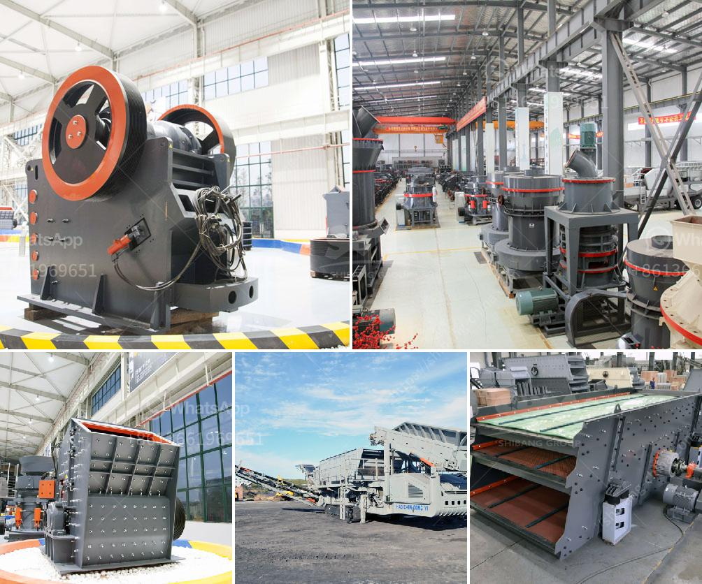

<h3>vibration ranges for jaw crusher</h3>
Vibration is a phenomenon that occurs in machines when they are in operation. Jaw crushers, used for crushing rocks and other hard materials, generate substantial vibrations that transmit through the entire body of the machine. It is important to understand the vibration characteristics of the jaw crusher as it can affect the performance of the machine in various ways.

The vibration of a crusher is generated by unbalanced rotating masses in the form of eccentric shafts located at the top and bottom of the machine. These eccentric shafts create a circular motion of the machine, which results in the transmission of vibrations through the body of the machine.

The frequency of the vibrations is directly related to the rotational speed of the eccentric shafts. A higher rotational speed results in higher vibration frequencies, and vice versa. The vibration frequencies of a jaw crusher should be in the range of 250 to 300 Hz in order to minimize the occurrence of resonant frequencies that can cause blockages in the crushing chamber and excess vibration in the drive system.

To achieve the desired vibration range, the eccentric shafts are designed with specific weights and lengths to create the necessary unbalance in the system. By adjusting the weights or lengths of the eccentric shafts, the amplitude of the vibrations can be changed. The amplitude determines the intensity of the vibrations and directly affects the capacity and efficiency of the crusher. A higher amplitude results in more intense vibrations, which can help in crushing harder materials, but may also cause excessive wear and tear on the machine.

In addition to the frequency and amplitude, it is also important to consider the direction of the vibrations. Ideally, the vibrations should be directed downwards, towards the crushing chamber, as this helps in the efficient crushing of rocks and prevents the material from bouncing back out of the chamber. Vibrations in other directions can result in reduced crushing efficiency and increased wear on the machine.

It is recommended to regularly monitor the vibration levels of a jaw crusher during operation to ensure that it is within the desired range. Excessive vibrations can indicate various issues such as misalignment, worn out bearings, or unbalanced rotating masses. By identifying and addressing these issues early on, it is possible to prevent major breakdowns and costly repairs.

In conclusion, the vibration range of a jaw crusher should be carefully controlled to ensure optimal performance and longevity of the machine. The frequency, amplitude, and direction of the vibrations should be within the desired range to prevent issues such as blockages, excess vibrations, and inefficient crushing. Regular monitoring of the vibration levels can help in identifying and resolving any potential issues before they escalate into more significant problems.
<h3>Contact us</h3><ul><li><strong>Whatsapp:&nbsp;<a href="https://wa.me/8613661969651">+8613661969651</a></strong></li><li><a href="https://swt.shibang-china.com/?git&amp;zhl&amp;vibration ranges for jaw crusher"><strong>Online Service(chat now)</strong></a></li></ul><h3>Related</h3><ul><li><a href='financial projections for a ore mining company.md'>financial projections for a ore mining company</a></li><li><a href='manufacturing proccess of aggregate.md'>manufacturing proccess of aggregate</a></li><li><a href='gyratory cone crusher.md'>gyratory cone crusher</a></li><li><a href='grinding equipment cost estimate.md'>grinding equipment cost estimate</a></li><li><a href='hammer mills hammer mills.md'>hammer mills hammer mills</a></li></ul>