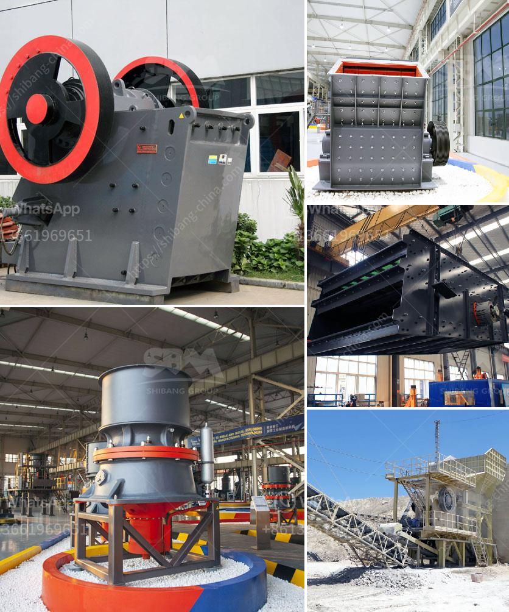

<h3>vibratory feeders in south africa</h3>
South Africa is a country known for its extensive mining and construction activities. These industries require the use of a variety of equipment, including vibratory feeders, to ensure their ongoing operation. Vibratory feeders play a crucial role in these industries by efficiently and effectively transporting bulk materials such as granules, powders, and other materials from one stage of the production process to another.

A vibratory feeder, also known as a vibrating feeder, utilizes vibrations to process and discharge materials in a controlled manner. This technology is widely used in industries such as mining, metallurgy, coal, power plants, chemical processing, and many more. The primary function of a vibratory feeder is to deliver a uniform flow of material into a process or machine, enhancing operational efficiency and reducing manual labor.

In South Africa, the application of vibratory feeders is prevalent in the mining industry. This industry heavily relies on a steady flow of minerals and ores to facilitate various operations, such as crushing, screening, and conveying. Vibratory feeders are utilized to ensure a consistent supply of materials, helping mining companies optimize their productivity and minimize downtime.

The construction industry in South Africa also relies on vibratory feeders to streamline their processes. Construction projects require the efficient transport of materials such as sand, gravel, and cement to different workstations. Vibratory feeders ensure the continuous delivery of these materials, facilitating smooth construction operations and timely project completion.

Apart from mining and construction, vibratory feeders find applications in other sectors in South Africa. These include food processing, pharmaceuticals, chemicals, and recycling, among others. The versatility and reliability of these feeders make them an essential component in an array of industries, where precision, efficiency, and automation are paramount.

In conclusion, vibratory feeders are indispensable equipment in South Africa's mining, construction, and various other industries. Their ability to transport bulk materials efficiently and uniformly ensures uninterrupted production processes. As these industries continue to adapt and grow, the demand for vibratory feeders will remain strong, making them a vital component in South Africa's industrial landscape.
<h3>Contact us</h3><ul><li><strong>Whatsapp:&nbsp;<a href="https://wa.me/8613661969651">+8613661969651</a></strong></li><li><a href="https://swt.shibang-china.com/?git&amp;zhl&amp;vibratory feeders in south africa"><strong>Online Service(chat now)</strong></a></li></ul><h3>Related</h3><ul><li><a href='crushed calcite manufacturer in rajasthan.md'>crushed calcite manufacturer in rajasthan</a></li><li><a href='gypsum processing equipment.md'>gypsum processing equipment</a></li><li><a href='jaw crusher for sale in kenya.md'>jaw crusher for sale in kenya</a></li><li><a href='crushing machine for chromium and chromite ore.md'>crushing machine for chromium and chromite ore</a></li><li><a href='bauxite mining machine.md'>bauxite mining machine</a></li></ul>