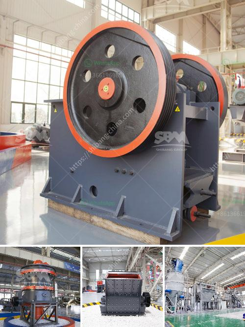

<h3>vibratory screen manufacturer</h3>
In today's fast-paced world of industrial production, every step towards increasing efficiency counts. One crucial aspect that manufacturers pay close attention to is the process of screening and sorting materials. This is where a vibratory screen manufacturer plays a vital role in delivering not only efficiency but also quality.

A vibratory screen is a type of machinery used to separate materials based on their size. It is widely used in industries such as mining, construction, and recycling, among others. The screen operates by vibrating the material, allowing for separation based on particle size. This results in a more efficient and accurate screening process compared to other methods.

A reputable vibratory screen manufacturer understands the importance of meeting their clients' requirements and providing tailor-made solutions. They utilize cutting-edge technology and rigorous quality control measures to ensure that their screens deliver optimal performance. These manufacturers employ skilled engineers who are well-versed in the intricacies of vibratory screen design, ensuring that each screen is perfectly suited to the intended application.

Furthermore, a reliable vibratory screen manufacturer takes into account the specific needs of their clients. They work closely with them to understand their requirements, such as throughput capacity, material characteristics, and the desired final product. This collaborative approach allows the manufacturer to design a customized screen that maximizes efficiency and productivity.

Aside from efficiency, quality is another crucial aspect that a vibratory screen manufacturer prioritizes. They adhere to strict industry standards and guidelines to guarantee the durability and longevity of their screens. High-quality materials, robust construction, and meticulous assembly processes are employed to ensure that the screens can withstand demanding operating conditions.

Additionally, a reputable manufacturer offers comprehensive after-sales support. They provide maintenance and servicing assistance, ensuring that their screens operate optimally throughout their lifespan. This commitment to customer satisfaction sets them apart from others, as they establish long-term partnerships with their clients.

In conclusion, a vibratory screen manufacturer plays a significant role in delivering efficiency and quality to industrial production processes. Their ability to design and manufacture tailor-made screens, coupled with their commitment to customer satisfaction, ensures that their clients maximize their productivity and achieve superior screening outcomes. Whether it's for separating minerals, classifying aggregates, or processing waste materials, a reputable vibratory screen manufacturer is the go-to source for efficient and reliable screening solutions.
<h3>Contact us</h3><ul><li><strong>Whatsapp:&nbsp;<a href="https://wa.me/8613661969651">+8613661969651</a></strong></li><li><a href="https://swt.shibang-china.com/?git&amp;zhl&amp;vibratory screen manufacturer"><strong>Online Service(chat now)</strong></a></li></ul><h3>Related</h3><ul><li><a href='silica crusher plant in the philippines.md'>silica crusher plant in the philippines</a></li><li><a href='coal mine conveyor belt for sale.md'>coal mine conveyor belt for sale</a></li><li><a href='crusher machine in malaysia.md'>crusher machine in malaysia</a></li><li><a href='mobile screening plant for sale.md'>mobile screening plant for sale</a></li><li><a href='cost of dolomite milling machine in india.md'>cost of dolomite milling machine in india</a></li></ul>