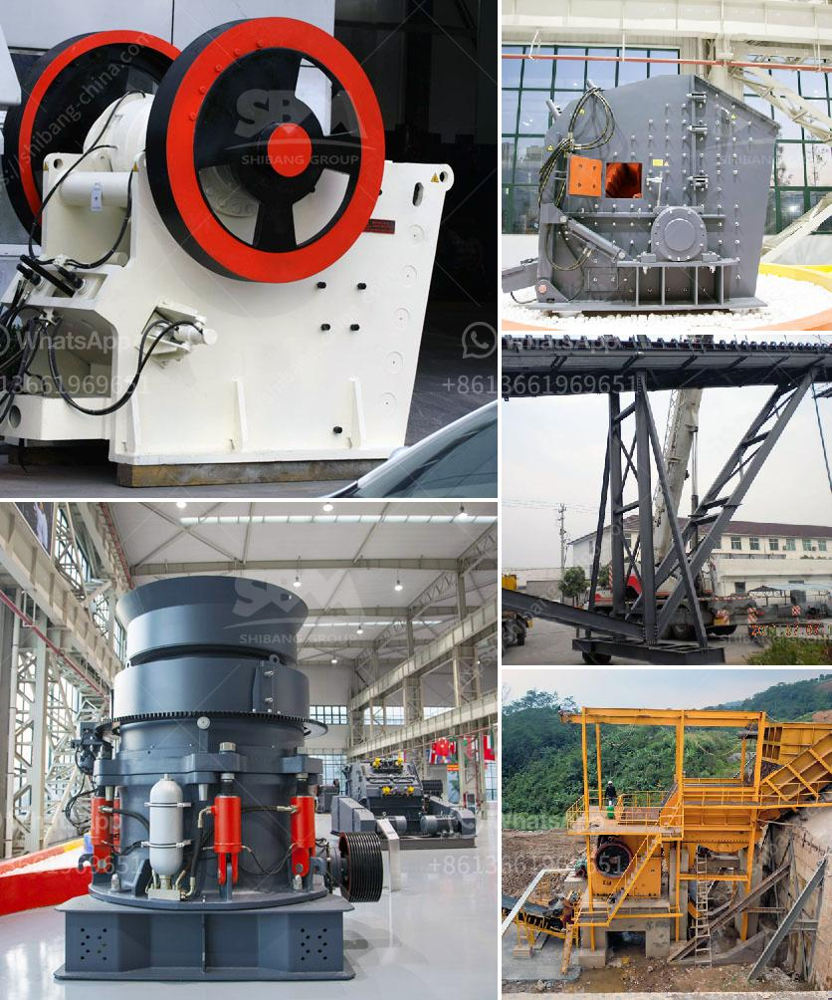

<h3>vrm and ball mill circulating load</h3>
Localized temperatures in the grinding circuit will inhibit further grinding. By reducing the amount of particles over-sized to the mill, the circulating load increases because more fresh feed is expanded. Thus, mill capacity increases while the circulating load ratio decreases. Additionally, historic data indicates that differential pressure across the mill drum has a strong correlation to grinding efficiency. This means that increasing the circulating load, while reducing operating power consumption, may improve grinding efficiency.

The concept of circulating load can be applied to both VRM and ball mill circuits. By balancing the circulating load, a stable grinding condition is obtained. The VRM offers several benefits compared to the ball mill, such as a higher grinding efficiency, a reduced power consumption, and a smaller footprint. Additionally, the VRM operates with a low noise level and a low dust emission, which makes it a more environmentally friendly choice.

Circulating load calculation in grinding circuits is generally done using the traditional methods. However, these methods have limitations, especially when applied to VRM circuits. The traditional method calculates the circulating load using the mass flow rate of coarse material and solids concentration in the mill. However, this method assumes a perfect mixing of particles, which is not always the case in VRM circuits. The traditional method may overestimate or underestimate the actual circulating load in VRM circuits, therefore new approaches need to be developed.

One such approach is based on the concept of "fines bypass". This concept assumes that the grinding process occurs in two stages: a coarse grinding stage in the VRM and a fine grinding stage in the ball mill. The fines bypass is the fraction of particles that bypass the ball mill and return to the VRM for further grinding. By analyzing the fines bypass and the particle size distribution, it is possible to estimate the actual circulating load in VRM circuits.

The VRM and ball mill circulating load can be adjusted to control the grinding efficiency, maximize the mill capacity, or reduce the power consumption. The Small-Scale Gold Processing Plant is specially designed for the small-scale gold mining miners. The whole plant consists of one hammer crusher, one centrifugal concentrator and one water pump. The plant is very suitable for remote areas because of its simple equipment design, easy maintenance, and convenient operation. The company has designed the Small-Scale Gold Processing Plant specifically for the African market.
<h3>Contact us</h3><ul><li><strong>Whatsapp:&nbsp;<a href="https://wa.me/8613661969651">+8613661969651</a></strong></li><li><a href="https://swt.shibang-china.com/?git&amp;zhl&amp;vrm and ball mill circulating load"><strong>Online Service(chat now)</strong></a></li></ul><h3>Related</h3><ul><li><a href='crusher manufacturer in pune.md'>crusher manufacturer in pune</a></li><li><a href='machine that crushes stones to ballast.md'>machine that crushes stones to ballast</a></li><li><a href='crushing plant aggregate type.md'>crushing plant aggregate type</a></li><li><a href='cost of setting up a stamp mill in zimbabwe.md'>cost of setting up a stamp mill in zimbabwe</a></li><li><a href='hydrated lime machine.md'>hydrated lime machine</a></li></ul>