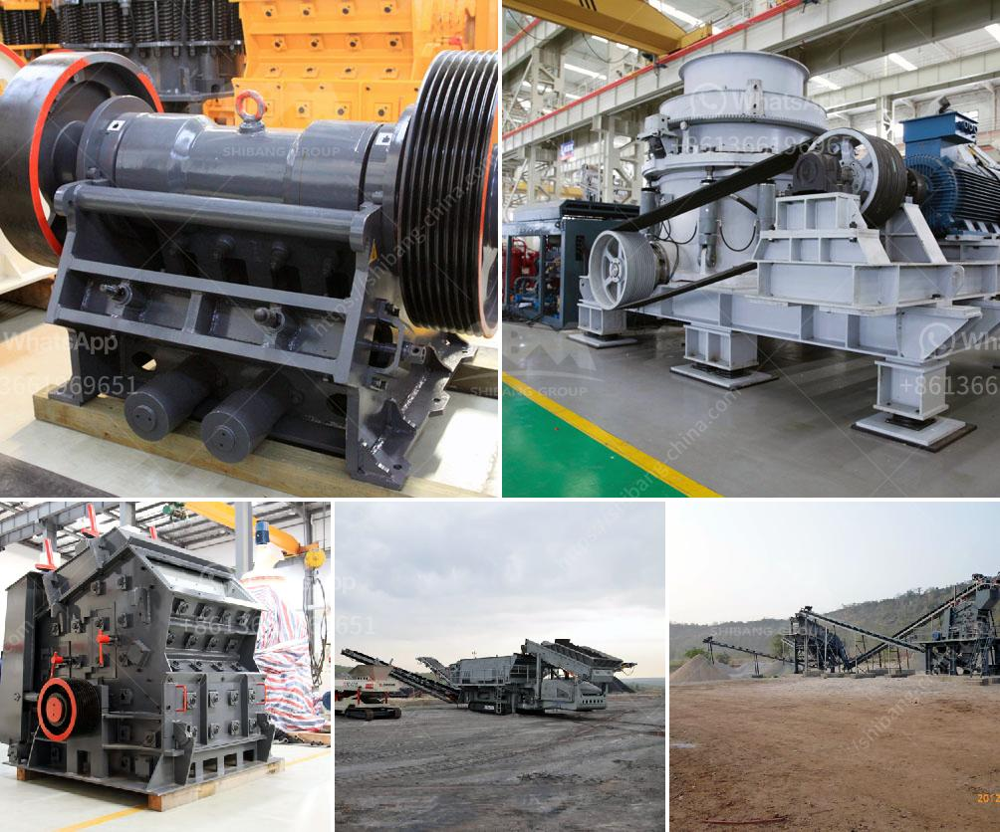

<h3>want to buy crusher pozzolan</h3>
If you are in the construction industry or involved in infrastructure development projects, you may be familiar with the term "pozzolan". Pozzolan is a natural or artificial material that, when combined with ordinary Portland cement, enhances the performance of concrete. It improves strength, durability, and workability, making it an essential component in many construction projects.

When it comes to acquiring pozzolan for your construction needs, buying a crusher pozzolan can offer several advantages. A crusher pozzolan is a machine used to crush rocks, minerals, or other materials into smaller pieces, making it easier to mix with cement to create pozzolan.

1. Cost-effectiveness: Investing in a crusher pozzolan can significantly reduce costs in the long run. Instead of purchasing pozzolan from external sources, which can be costly, you can produce your own supply by crushing raw materials on-site. This not only saves money but also gives you better control over quality and availability.

2. Flexibility in supply: Owning a crusher pozzolan gives you the flexibility to produce pozzolan according to your project's requirements. You can adjust the crushing process to achieve the desired particle size and meet specific project specifications. This flexibility ensures a constant, reliable supply of pozzolan, minimizing project delays and interruptions.

3. Quality control: With a crusher pozzolan, you have the advantage of monitoring and controlling the entire production process. You can select the raw materials, adjust the crushing parameters, and conduct regular quality checks to ensure the final product meets the required standards. This level of control enhances the quality and consistency of the pozzolan, ultimately improving the performance of your concrete.

4. Environmental benefits: Owning a crusher pozzolan can contribute to a more sustainable construction process. By crushing and reusing various materials, you can minimize waste and reduce the need for new raw materials, thus conserving natural resources. Additionally, crushing on-site reduces transportation emissions and the overall carbon footprint associated with procuring pozzolan from external sources.

5. Competitive advantage: Incorporating a crusher pozzolan into your construction operations can give you a competitive edge. By producing your own pozzolan, you gain control over the supply chain, eliminate dependence on external suppliers, and potentially reduce costs. This enables you to offer more competitive pricing to clients or bid more competitively on construction projects, helping you secure more contracts and grow your business.

In conclusion, considering the advantages mentioned above, it is worth exploring the option of buying a crusher pozzolan if you are involved in construction or infrastructure development. The cost-effectiveness, flexibility in supply, quality control, environmental benefits, and competitive advantage make it an attractive investment. However, before purchasing, conduct thorough research, evaluate your project requirements, and choose a reliable supplier to ensure you get the most out of your crusher pozzolan.
<h3>Contact us</h3><ul><li><strong>Whatsapp:&nbsp;<a href="https://wa.me/8613661969651">+8613661969651</a></strong></li><li><a href="https://swt.shibang-china.com/?git&amp;zhl&amp;want to buy crusher pozzolan"><strong>Online Service(chat now)</strong></a></li></ul><h3>Related</h3><ul><li><a href='200 tph mobile crusher prices used.md'>200 tph mobile crusher prices used</a></li><li><a href='portable vibrating coal screen.md'>portable vibrating coal screen</a></li><li><a href='ball milling in chemistry.md'>ball milling in chemistry</a></li><li><a href='crusher machine manufacturers shanghai.md'>crusher machine manufacturers shanghai</a></li><li><a href='prices of granite crusher.md'>prices of granite crusher</a></li></ul>