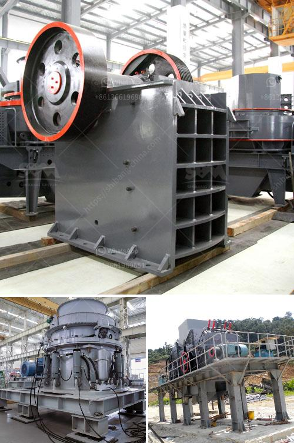

<h3>washing plant for silica</h3>
A washing plant for silica is a highly advanced and efficient facility designed to remove impurities, such as dust, clay, and other unwanted matter from silica ore. This process ensures a consistent and high-quality product for various industrial applications.

Silica, also known as silicon dioxide, is a mineral abundant in the Earth's crust. It is commonly found in sand, quartz, and various types of rocks. Silica is a crucial raw material for industries such as glass manufacturing, construction, ceramics, electronics, and many more. However, in its raw form, silica can contain impurities that hinder its effectiveness.

A washing plant for silica operates on a series of steps to purify the raw silica ore. The process begins with feeding the material into a vibrating feeder, where it is evenly distributed for efficient washing. From there, the material is conveyed into a drum scrubber, which uses high-pressure water to remove any clay or other impurities adhering to the silica ore.

As the material is transported through the drum scrubber, it tumbles and rotates, allowing the water to break down and separate the impurities effectively. The water used in this process contains specific chemicals to enhance the cleaning and eliminate any organic matter that may be present.

After exiting the drum scrubber, the material moves through various stages of classification and separation. This includes passing through screens, hydrocyclones, and spirals, which further isolate and remove the impurities. The cleaned silica ore is then ready for further processing or direct use in various industries.

The washing plant for silica is equipped with state-of-the-art technology and multiple stages of cleaning to ensure the highest quality and purity of the final product. It is designed to handle a wide range of silica ore with varying levels of impurities, efficiently eliminating even the smallest contaminants.

In conclusion, a washing plant for silica plays a vital role in the purification process of silica ore. By removing impurities and achieving a high degree of cleanliness, it enables industries to utilize silica in their processes, hence enhancing product quality and performance. This advanced facility serves as a crucial component for meeting the increasing demand for high-quality silica in various industrial sectors.
<h3>Contact us</h3><ul><li><strong>Whatsapp:&nbsp;<a href="https://wa.me/8613661969651">+8613661969651</a></strong></li><li><a href="https://swt.shibang-china.com/?git&amp;zhl&amp;washing plant for silica"><strong>Online Service(chat now)</strong></a></li></ul><h3>Related</h3><ul><li><a href='mtm trapezium mill.md'>mtm trapezium mill</a></li><li><a href='product japan crushing plant.md'>product japan crushing plant</a></li><li><a href='iron processing plant price.md'>iron processing plant price</a></li><li><a href='used crusher plant in dubai for sale.md'>used crusher plant in dubai for sale</a></li><li><a href='portable concrete crusher.md'>portable concrete crusher</a></li></ul>