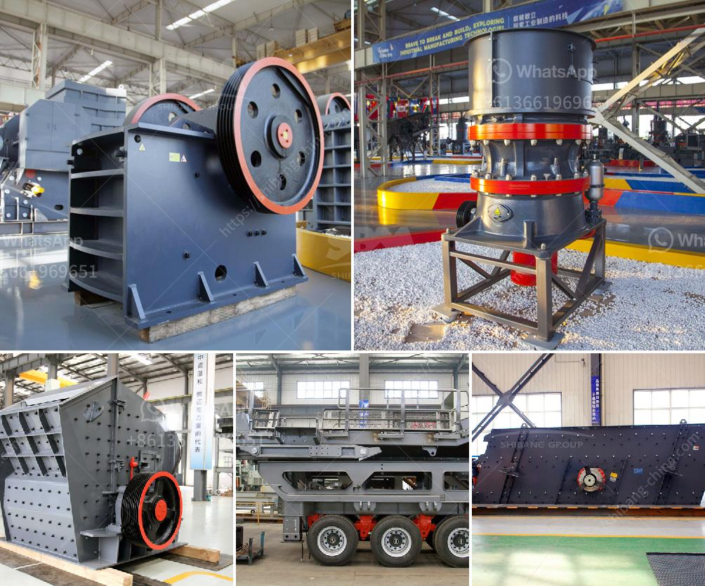

<h3>wet ball milling</h3>
Wet ball milling is a method that reduces the size of particles in a liquid medium by rapidly mixing and shearing the particles and the liquid. It is widely used for size reduction of slurries, especially in the ceramic industry.

Wet ball milling helps to reduce the particle size distribution of a product, in a liquid medium, by effectively milling a range of materials and then filtering the primer to remove the liquid components. Moreover, this method is beneficial for removing surface contamination or preventing contamination of the milling media during the milling process.

The wet ball milling process employs high-energy ball mills, which can rapidly deliver grinding energy, thereby reducing the particle size of the ground material. This grinding method requires a consistent input of energy compared to mechanical grinding methods, making it a suitable choice for grinding materials that cannot be ground using other mechanical milling techniques.

One of the advantages of wet ball milling is the effective dispersion of fine particles into the liquid medium. This can lead to improved homogeneity and stability of the resulting suspension. The smaller particle size resulting from wet ball milling also leads to enhanced kinetics of chemical reactions, making it useful for a variety of applications, including pharmaceuticals, food processing, and cosmetics.

Another benefit of wet ball milling is the ability to control the particle size distribution of the final product. By adjusting various parameters such as the milling time, milling speed, and liquid-to-solid ratio, one can obtain a wide range of particle sizes, ranging from a few nanometers to several micrometers. This level of control is crucial in various industries, particularly those that require particles of specific sizes for their formulations.

Wet ball milling is also advantageous in terms of energy efficiency. The milling process requires less energy compared to other grinding methods, such as dry milling or mechanical grinding. This can result in lower energy consumption and reduced operating costs for industrial processes that rely on size reduction.

Despite these advantages, wet ball milling does have some limitations. One of the main challenges is the potential for equipment corrosion due to contact with liquid media for extended periods. Corrosion can result in contamination of the milled material, impacting the quality of the final product. To mitigate this issue, materials with corrosion-resistant properties, such as stainless steel or ceramics, are often used for the milling media and milling containers.

In conclusion, wet ball milling is a versatile grinding method that offers several advantages over other milling techniques. It allows for effective particle size reduction, improved dispersion of particles in a liquid medium, control over the particle size distribution, and energy efficiency. Despite the challenges associated with equipment corrosion, wet ball milling is widely used in various industries for size reduction and formulation purposes.
<h3>Contact us</h3><ul><li><strong>Whatsapp:&nbsp;<a href="https://wa.me/8613661969651">+8613661969651</a></strong></li><li><a href="https://swt.shibang-china.com/?git&amp;zhl&amp;wet ball milling"><strong>Online Service(chat now)</strong></a></li></ul><h3>Related</h3><ul><li><a href='calcium carbonate plant manufacturers.md'>calcium carbonate plant manufacturers</a></li><li><a href='coal crushing machine in malaysia.md'>coal crushing machine in malaysia</a></li><li><a href='graphite beneficiation plant for sale.md'>graphite beneficiation plant for sale</a></li><li><a href='business plan for small scale chrome mining.md'>business plan for small scale chrome mining</a></li><li><a href='gypsum crusher machine turkey.md'>gypsum crusher machine turkey</a></li></ul>