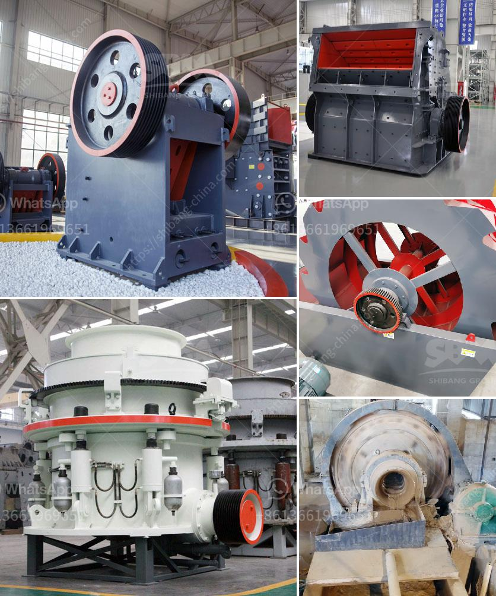

<h3>what are the prices of crushing equipment</h3>
Crushing equipment plays a significant role in various industries such as mining, construction, and recycling. Choosing the appropriate crushing equipment for specific applications requires careful consideration of several factors, including the type of material, required output size, production capacity, and budget. We will explore these factors and provide an overview of the prices associated with crushing equipment in this article.

a. Jaw Crushers: Jaw crushers are commonly used in primary crushing applications and have different price ranges depending on the size and capacity. Small jaw crushers suitable for low to medium capacity requirements can range from $1,500 to $10,000, while larger and more heavy-duty options can go up to $40,000 and beyond.

b. Cone Crushers: Cone crushers are ideal for secondary and tertiary crushing. They are available in various sizes and configurations, impacting their price range. Entry-level cone crushers may start around $50,000, while high-capacity models equipped with additional features can exceed $500,000.

c. Impact Crushers: Impact crushers are versatile machines commonly used for both primary and secondary crushing. They vary in size and power, affecting their price. Compact impact crushers suitable for small-scale applications can cost between $20,000 to $70,000, whereas larger, high-capacity models can exceed $1 million.

d. Hammer Mills: Hammer mills are primarily used for fine grinding and pulverization of materials. They are available in diverse sizes and designs, ranging from $1,000 to over $100,000, depending on capacity and specifications.

e. Gyratory Crushers: Gyratory crushers are primarily used in large-scale mining and quarrying operations. Due to their immense size and power, they are generally the most expensive option, with prices starting at a few million dollars.

a. Quality and Durability: High-quality and durable crushing equipment tends to cost more upfront but offers better performance, reduced maintenance, and longer lifespan.

b. Production Capacity: The desired production capacity directly affects the equipment's cost. Higher capacity requirements generally lead to more expensive equipment.

c. Material Hardness and Abrasiveness: Harder and more abrasive materials, like granite or basalt, require more robust and specialized machinery, resulting in higher prices.

d. Maintenance and Operational Costs: Consider the lifespan and maintenance requirements of the equipment. Equipment that requires less frequent maintenance and has lower operational costs can save money in the long run.

e. Additional Features: Advanced features, such as automated controls, remote monitoring, and improved safety systems, can enhance productivity but also increase the overall equipment cost.

When exploring crushing equipment options, it is crucial to consider various factors, including the type of material to be processed, required production capacity, and budget constraints. While prices can vary significantly, the quality, durability, and features of the equipment should take precedence over the initial purchase cost. It is advisable to consult with industry professionals and carefully evaluate the specific requirements before investing in crushing equipment.
<h3>Contact us</h3><ul><li><strong>Whatsapp:&nbsp;<a href="https://wa.me/8613661969651">+8613661969651</a></strong></li><li><a href="https://swt.shibang-china.com/?git&amp;zhl&amp;what are the prices of crushing equipment"><strong>Online Service(chat now)</strong></a></li></ul><h3>Related</h3><ul><li><a href='vertical impact crusher quote.md'>vertical impact crusher quote</a></li><li><a href='stone crushing machines uk.md'>stone crushing machines uk</a></li><li><a href='chart of accounts for cement factory.md'>chart of accounts for cement factory</a></li><li><a href='roller mill in india.md'>roller mill in india</a></li><li><a href='crushing service with peru jaw crusher.md'>crushing service with peru jaw crusher</a></li></ul>