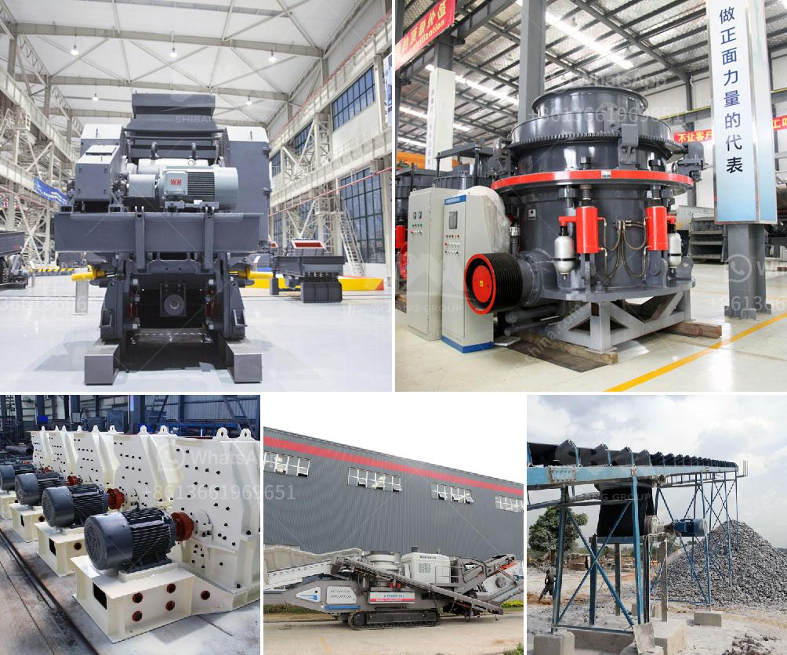

<h3>what is difference between crusher and mills</h3>
Crusher and mills are two essential machines in the mining and aggregates industry. They both play a vital role in reducing the size of rocks and ore materials for further processing. However, there are several key differences between them.

Firstly, crushers are used for primary crushing, whereas mills are used for secondary crushing and pulverization. The crushing process is usually performed using compression, which applies force to break the larger particles into smaller pieces. Crushers can be categorized into three main types: jaw crushers, cone crushers, and impact crushers. These machines are ideal for materials with high moisture content or those that are hard and abrasive.

On the other hand, mills are designed to pulverize materials into fine particles. They use a combination of impact, attrition, and compression forces to achieve this. Mills come in various types, including ball mills, rod mills, and hammer mills. The choice of mill depends on the desired particle size distribution and the properties of the material being processed.

Another significant difference between crushers and mills is the feeding mechanism. Crushers have a hopper that allows the material to be fed into the machine, whereas mills have a feed chute or pipe where the material is introduced into the rotating drum or cylinder. This design difference ensures that the material being processed is adequately captured and processed in the desired manner.

Additionally, crushers are typically operated at a higher speed than mills, which enables faster and more efficient crushing. Mills, on the other hand, operate at a slower rotational speed to achieve the desired particle size reduction without causing excessive wear on the equipment.

In summary, crushers and mills serve different purposes in the mining and aggregates industry. While crushers are used for primary crushing, mills are employed for secondary crushing and pulverization. The feeding mechanism, speed of operation, and the type of forces applied during the process also differentiate these two machines. Understanding the distinctions between crushers and mills is essential for selecting the appropriate equipment for specific operations and achieving the desired end product.
<h3>Contact us</h3><ul><li><strong>Whatsapp:&nbsp;<a href="https://wa.me/8613661969651">+8613661969651</a></strong></li><li><a href="https://swt.shibang-china.com/?git&amp;zhl&amp;what is difference between crusher and mills"><strong>Online Service(chat now)</strong></a></li></ul><h3>Related</h3><ul><li><a href='portable crusher plant.md'>portable crusher plant</a></li><li><a href='crushing mill and impact mill.md'>crushing mill and impact mill</a></li><li><a href='size ball mills for miner.md'>size ball mills for miner</a></li><li><a href='mobile crusher morocco.md'>mobile crusher morocco</a></li><li><a href='mobile gold hammer crusher for sale philippines.md'>mobile gold hammer crusher for sale philippines</a></li></ul>