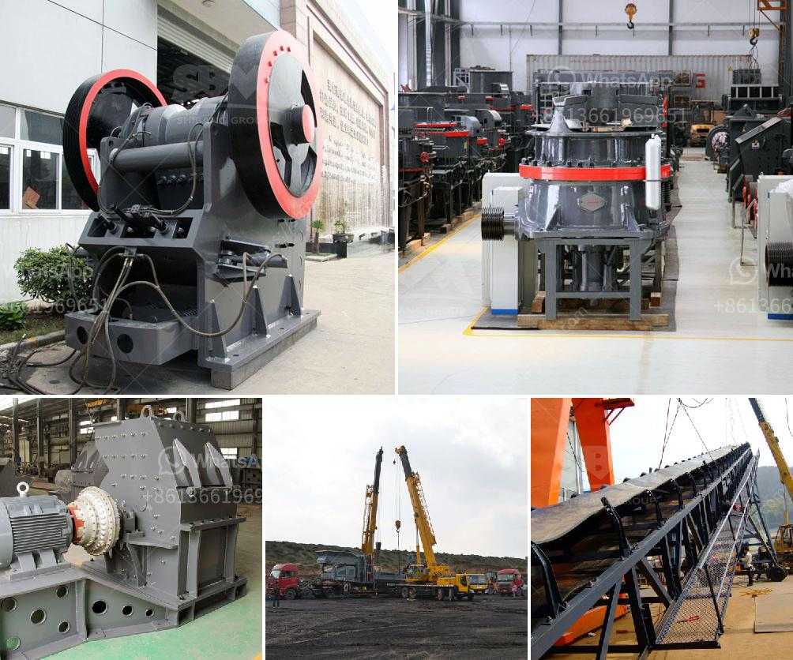

<h3>what is the angle of conveyor belts</h3>
The angle of conveyor belts, also known as the incline angle, refers to the angle at which the conveyor system is inclined above the horizontal plane. It determines the maximum conveying capacity, conveying efficiency, and the overall performance of the conveyor system. Multiple factors need to be considered when choosing the angle of conveyor belts, including material properties, the required conveying speed, and the overall design of the system.

One of the primary considerations when determining the angle of conveyor belts is the material being conveyed. Depending on its nature, certain materials may require specific angles for efficient transport. For example, bulk materials with large particle sizes tend to have a higher angle of repose, interacting differently with the belt surface. In such cases, a steeper incline or decline is sometimes necessary to ensure proper flow and avoid material spillage.

Another significant factor to consider is the required conveying speed. Conveyor systems are commonly used to transport materials over long distances or at high speeds. In these cases, the angle of the conveyor belts directly affects the system's overall efficiency. A slight incline can help improve the conveying speed, allowing materials to reach their destination faster while maintaining proper control and preventing material loss.

Additionally, the design of the conveyor system plays a crucial role in determining the appropriate angle. Factors such as the belt width, pulley diameter, and the overall layout of the system can determine the maximum allowable incline. These technical considerations are essential to maintain the stability and functionality of the conveyor system. An angle that is too steep can lead to belt slippage or even system failure, while an angle that is too flat may result in ineffective material transport.

It is worth noting that different industries may have specific requirements for conveyor belt angles. For instance, in mining operations, conveyor belts are often inclined to transport materials from underground mines to the surface. In such cases, highly durable belts and adequate incline angles are necessary to overcome the challenges of transporting heavy loads over long distances.

In conclusion, the angle of conveyor belts is a critical component of conveyor system design. It affects the system's overall performance, conveying efficiency, and material flow. The angle should be carefully chosen based on the material properties, required speed, and the overall design of the system. By considering these factors, engineers and designers can determine the optimal angle for effective material transport in various industries.
<h3>Contact us</h3><ul><li><strong>Whatsapp:&nbsp;<a href="https://wa.me/8613661969651">+8613661969651</a></strong></li><li><a href="https://swt.shibang-china.com/?git&amp;zhl&amp;what is the angle of conveyor belts"><strong>Online Service(chat now)</strong></a></li></ul><h3>Related</h3><ul><li><a href='prices of conveyor belts for mining.md'>prices of conveyor belts for mining</a></li><li><a href='ball mill for sale in india.md'>ball mill for sale in india</a></li><li><a href='gold mining used jaw crusher.md'>gold mining used jaw crusher</a></li><li><a href='gold mining equipment for sale in uganda.md'>gold mining equipment for sale in uganda</a></li><li><a href='sand making machine indonesia.md'>sand making machine indonesia</a></li></ul>