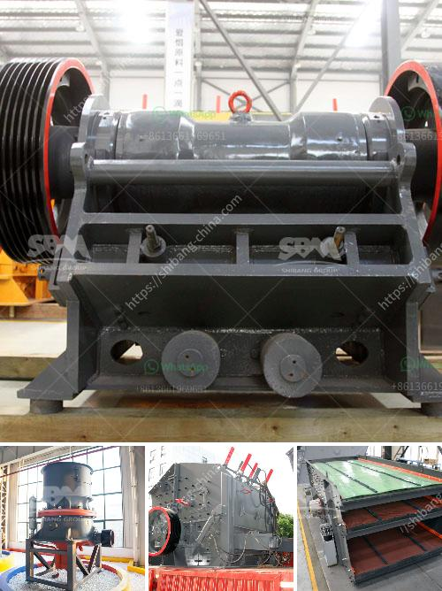

<h3>what is the cost of crusher</h3>
Crushers are used in various industries such as mining, construction, material recycling, and others. They offer an effective and efficient method of reducing the size of rocks and materials for further processing. However, the cost of acquiring a crusher can vary depending on several factors. Let's delve into the details and understand the cost of a crusher.

One of the main factors that influence the cost of a crusher is the type of crusher you choose. There are various types of crushers available in the market, such as jaw crushers, cone crushers, impact crushers, and others. Each type of crusher has different features and capabilities, and their prices also differ accordingly.

Another factor that determines the cost of a crusher is its capacity or production rate. A crusher with a higher capacity will be more expensive compared to a crusher with a lower capacity. The capacity requirement depends on the amount of material you need to process within a given time frame. If you have a high-volume production requirement, you may need a crusher with a higher capacity, which will result in a higher cost.

Apart from the type and capacity, the features and specifications of the crusher can also impact its cost. Advanced features such as automation, adjustable settings, and energy efficiency may increase the cost of the crusher. However, these additional features can also enhance the operational efficiency and productivity, thereby providing long-term cost savings.

The brand and reputation of the crusher manufacturer can also influence its cost. Established and reputed manufacturers may charge a higher price for their crushers due to their brand value and quality assurance. Investing in a well-known brand can offer peace of mind as it ensures better reliability, after-sales support, and availability of spare parts, reducing maintenance and operational costs in the long run.

The location and logistics also play a role in the cost of a crusher. If you are purchasing a crusher from a manufacturer located far away from your site, the transportation cost may add up. Additionally, the availability of skilled labor and expertise in your area can also impact the overall cost. It is important to consider these factors while calculating the total cost of acquisition.

Apart from the initial purchase cost, there are other operational costs associated with a crusher. These costs include maintenance, repairs, and any potential downtime. Regular maintenance is crucial to ensure the optimal performance and longevity of the crusher. It is advisable to factor in these ongoing costs while evaluating the total cost of a crusher.

In conclusion, the cost of a crusher can vary depending on various factors such as type, capacity, features, brand reputation, location, and ongoing operational costs. It is essential to thoroughly evaluate these factors before making a purchasing decision. Considering the long-term benefits and cost savings that a well-performing crusher can provide, investing in a high-quality and suitable crusher is a worthwhile decision for any industry. So, research, compare options, and choose wisely to get the best value for your investment.
<h3>Contact us</h3><ul><li><strong>Whatsapp:&nbsp;<a href="https://wa.me/8613661969651">+8613661969651</a></strong></li><li><a href="https://swt.shibang-china.com/?git&amp;zhl&amp;what is the cost of crusher"><strong>Online Service(chat now)</strong></a></li></ul><h3>Related</h3><ul><li><a href='list price vibrating screen.md'>list price vibrating screen</a></li><li><a href='copper gold processing plant.md'>copper gold processing plant</a></li><li><a href='capacity screener coal tonhcapacity stone crusher.md'>capacity screener coal tonhcapacity stone crusher</a></li><li><a href='stone crusher plant ton per hour.md'>stone crusher plant ton per hour</a></li><li><a href='philippines crushing machine manufacturer in pakistan.md'>philippines crushing machine manufacturer in pakistan</a></li></ul>