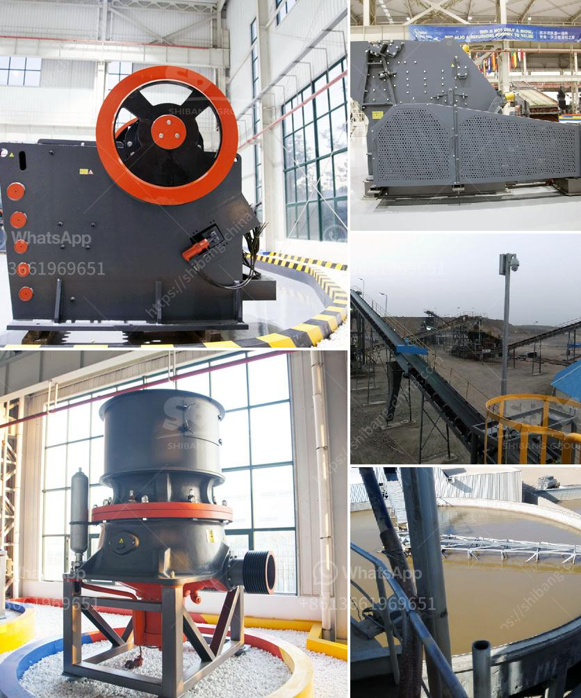

<h3>work method statement for jaw crusher</h3>
A work method statement, sometimes referred to as a safe work method statement or a safe work procedure, is a document that outlines the way a work task or process will be carried out. This statement includes a step-by-step guide on how to perform the task and any associated hazards or risks that need to be considered.

In the construction industry, a work method statement is essential for ensuring the safety of workers and compliance with health and safety regulations. One common task in the construction industry is the operation of a jaw crusher, a machine that grinds construction materials such as rocks, concrete, and asphalt into smaller pieces.

Jaw crushers are portable machines used to break and compress materials into smaller pieces. They are widely used in the mining, construction, demolition, and recycling industries. However, jaw crushers can be a hazard if not properly operated and maintained.

To ensure the safety and efficient operation of a jaw crusher, the worker responsible for the operation of the machine should follow a safe work method statement (SWMS). Failure to follow a SWMS for a jaw crusher can result in serious injury or even death.

1. Prepare for crushing operations - ensure all personnel and bystanders are clear of the crusher and obstructions in the work area.

2. Position the toggle plate - ensure the toggle plate is positioned correctly to stabilize and support the movable jaw.

4. Adjust the discharge opening - adjust the gap between the fixed jaw and the movable jaw to control the size and output of the crushed material.

5. Check the tension of the V-belt - ensure the V-belt is correctly tensioned to avoid slippage and potential damage to the machine.

6. Monitor the material feed - continuously monitor the material feed for blockages or jamming. If any issues are detected, stop the crusher immediately and address the problem.

7. Stop the crusher - once the desired amount of material has been crushed, stop the crusher and disconnect power sources.

8. Clean the crusher - remove any remaining material from the crusher and surrounding area. Ensure all tools and equipment are properly stored.

9. Conduct necessary maintenance - lubricate moving parts, inspect and replace worn or damaged parts, and schedule regular maintenance to keep the crusher in optimal condition.

10. Complete necessary paperwork - record the completion of the task and any important details or observations in the appropriate documentation.

While this work method statement provides a general guide for operating a jaw crusher, it is crucial to consult the manufacturer's instructions and comply with any specific safety guidelines provided. Additionally, undertaking relevant training and being aware of potential hazards associated with the specific jaw crusher being used is essential.

In conclusion, a work method statement is crucial for the safe and efficient operation of a jaw crusher. By following the steps outlined in the statement, workers can minimize the risk of accidents and ensure the longevity of the machine. Safety should always be the top priority when operating heavy machinery, and a well-prepared work method statement is a tool to achieve that goal.
<h3>Contact us</h3><ul><li><strong>Whatsapp:&nbsp;<a href="https://wa.me/8613661969651">+8613661969651</a></strong></li><li><a href="https://swt.shibang-china.com/?git&amp;zhl&amp;work method statement for jaw crusher"><strong>Online Service(chat now)</strong></a></li></ul><h3>Related</h3><ul><li><a href='gemstone washing machine in china.md'>gemstone washing machine in china</a></li><li><a href='high purity quartz crusher processing.md'>high purity quartz crusher processing</a></li><li><a href='aggregate crushing machine portable.md'>aggregate crushing machine portable</a></li><li><a href='rock crusher for quartz.md'>rock crusher for quartz</a></li><li><a href='grinding mills supplier in gujraanwala.md'>grinding mills supplier in gujraanwala</a></li></ul>