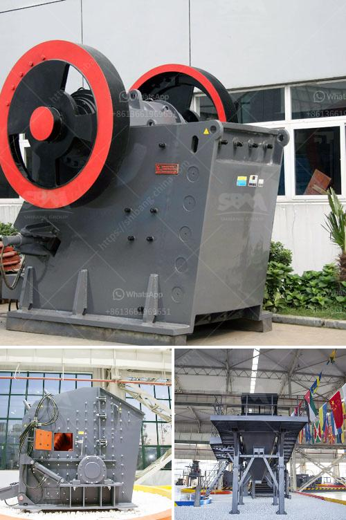

<h3>working machine of a stone crusher</h3>
A stone crusher machine is designed to reduce large rocks into smaller and more manageable particles. Crusher uses mechanical pressure for breaking of an ore or rock. Just like human jaw, it engulfs a feed to crush into more digestible output or the required output for the infrastructure and construction industry.

Crusher is a machine designed to reduce large rocks into smaller rocks, gravel, sand or rock dust. Crushers may be used to reduce the size, or change the form, of waste materials so they can be more easily disposed of or recycled, or to reduce the size of a solid mix of raw materials, so that pieces of different composition can be differentiated. Crushing is the process of transferring a force amplified by mechanical advantage through a material made of molecules that bond together more strongly, and resist deformation more, than those in the material being crushed do.

The earliest crushers were hand-held stones, where the weight of the stone provided a boost to muscle power, used against a stone anvil. Material to be crushed is fed into the top of the machine, where it is either drawn downward between crushing plates or a stationary sheet to be crushed by friction or impaction.

Nowadays, these machines are used in various sectors, such as mining, metallurgy, building materials, highways, railways, water conservancy, and chemical industries. The stone crushing machine industry is an important industrial sector in the country engaged in producing crushed stone used as raw material for various construction activities such as construction of roads, bridges, buildings, and canals.

The stone crushing equipment is capable enough to compress materials such as quartzite, stones, rocks, iron, coke, and others. The stone crushing equipment is extensively used in various verticals such as metallurgy, chemical, construction, and mining.

High adoption of machinery across various areas such as construction & building, mining, highways, railways, and metallurgy will spur the industry growth over the forecast time span. Increasing construction activities across the globe due to rising urbanization have resulted in the increased production of mobile crushers & screeners.

The market for mobile crushers and screeners on the basis of end-use is segmented into stone quarry, construction, mining, material recycling, and others. Stone quarry has generated the highest revenue owing to the increase in demand for stones, especially for infrastructure projects such as roads, bridges, and highways. The well-developed countries such as the U.S., the UK, Japan, and China have witnessed significant growth in the construction industry, which in turn drives the stone crushing equipment market.

The stone crushing machines finds use in a variety of fields such as building materials, mining, metallurgy, highways, chemistry, and railways etc. Based on the requirement put forth by the type of construction activity such as highways, roads, canals, buildings, and bridges etc., the stone crushing equipments can produce various sizes of crushed stone. With the current growth rate of global urbanization, the stone crushing equipment market is anticipated to witness a surge in demand for crushers applied in the construction of infrastructure and other activities. 

Overall, the working of a stone crusher machine seems to be much easier and highly productive as compared to other traditional machines that are used for crushing purposes.
<h3>Contact us</h3><ul><li><strong>Whatsapp:&nbsp;<a href="https://wa.me/8613661969651">+8613661969651</a></strong></li><li><a href="https://swt.shibang-china.com/?git&amp;zhl&amp;working machine of a stone crusher"><strong>Online Service(chat now)</strong></a></li></ul><h3>Related</h3><ul><li><a href='gold mining wash plants for sale in ghana.md'>gold mining wash plants for sale in ghana</a></li><li><a href='stone crusher finance project myanmar.md'>stone crusher finance project myanmar</a></li><li><a href='mobile stone crushers in usa.md'>mobile stone crushers in usa</a></li><li><a href='gemstone washing machine in china.md'>gemstone washing machine in china</a></li><li><a href='mobile crusher morocco.md'>mobile crusher morocco</a></li></ul>