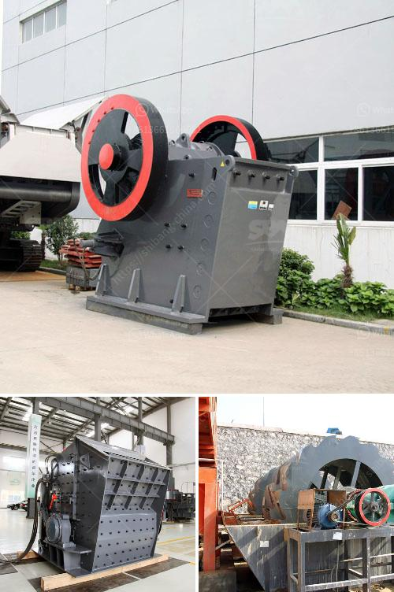

<h3>working principle of raw mill in cement plant</h3>
The cement raw mill is generally used as a grinding equipment in cement plants. In the process of cement production, raw materials need to be ground by the raw mill to reach the fineness required for the subsequent calcination process. The raw mill plays an important role in the cement production line.

The working principle of the raw mill is as follows: it uses the pressure and shear to crush the raw materials. The pressure is applied by the hydraulic system or the roller mechanism. By exerting pressure on the material through the roller, the raw materials are squeezed and ground, and then the finely ground materials are discharged through the outlet.

The raw mill is composed of a cylindrical shell, lining plate, hollow shaft, and grinding head. The cylinder is longitudinally and radially separated into several chambers by a partition plate. The grinding body is generally composed of steel balls, steel rods, or pebbles. The grinding body is continuously impacted, squeezed, and ground by the motion of the materials and the grinding media, so as to achieve the purpose of pulverization.

In addition, the raw mill is equipped with a drying chamber, which can dry the moisture content of the raw materials and prevent the material from being blocked in the mill. The drying chamber mainly uses the hot waste gas discharged from the kiln, or the hot air generated by the mill itself, to achieve the drying effect.

Furthermore, the raw materials in the raw mill are finely ground into raw meal, which is then transported to the kiln for calcination and further cement production. Therefore, the proper operation and maintenance of the raw mill are of great importance to ensure the stable and efficient operation of the cement production line.
<h3>Contact us</h3><ul><li><strong>Whatsapp:&nbsp;<a href="https://wa.me/8613661969651">+8613661969651</a></strong></li><li><a href="https://swt.shibang-china.com/?git&amp;zhl&amp;working principle of raw mill in cement plant"><strong>Online Service(chat now)</strong></a></li></ul><h3>Related</h3><ul><li><a href='stone crusher for excavator cost.md'>stone crusher for excavator cost</a></li><li><a href='stone quarry crusher equipment germany.md'>stone quarry crusher equipment germany</a></li><li><a href='marble stone milling plant.md'>marble stone milling plant</a></li><li><a href='crushed crusher price.md'>crushed crusher price</a></li><li><a href='used clay brick machine for sale in germany.md'>used clay brick machine for sale in germany</a></li></ul>