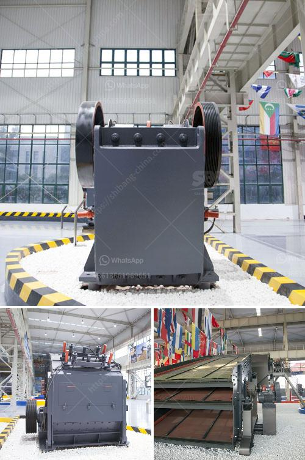

<h3>xzm series ultra fine mill zenith</h3>
The XZM series ultra-fine mill by Zenith is a machine designed to meet the requirements of modern pulverizing industry. It is based on new grinding technology and combines grinding, grading, conveying and powder processing in one machine. With its unique advantages, the XZM series ultra-fine mill stands out in the market and has become the preferred equipment for grinding non-metallic minerals.

The XZM series ultra-fine mill is equipped with various components to ensure high-performance grinding. The main unit consists of a grinding roller assembly, a grinding ring, a blade and a shell. The grinding roller assembly is suspended on the main shaft and is connected with the main machine through a flexible coupling. The grinding ring is driven by the rotation of the grinding roller to ensure efficient and even grinding of materials.

One of the key features of the XZM series ultra-fine mill is its high efficiency. The grinding roller and grinding ring are made of special wear-resistant materials, which can effectively improve the utilization rate of materials and extend the service life of the equipment. The grinding roller and grinding ring are both designed in a trapezoidal shape, which not only increases the grinding area but also reduces the resistance during grinding, resulting in higher grinding efficiency.

In addition to its high efficiency, the XZM series ultra-fine mill also has a wide range of applications. It can be used to grind various non-flammable and non-explosive materials with hardness below 7 and moisture content below 6%, such as calcite, limestone, dolomite, marble, barite, talc, gypsum, etc. With its excellent performance, it can produce fine and superfine powder, which can be widely used in industries such as metallurgy, chemical engineering, papermaking, rubber, plastics, and coatings.

Another advantage of the XZM series ultra-fine mill is its advanced control system. It adopts PLC control and is equipped with a human-machine interface touch screen, making the operation more convenient and intuitive. The control system can automatically adjust the grinding pressure, feed rate, and fineness of the powder according to the actual production demand, ensuring stable and reliable operation of the equipment.

In conclusion, the XZM series ultra-fine mill by Zenith is a high-efficiency and multi-functional grinding equipment with advanced technology. It has the advantages of high grinding efficiency, wide application range, and intelligent control system. Whether in the grinding of non-metallic minerals or other materials, the XZM series ultra-fine mill can provide high-quality powder products. With its excellent performance, it has gained a good reputation in the market and has become the preferred choice for customers in the pulverizing industry.
<h3>Contact us</h3><ul><li><strong>Whatsapp:&nbsp;<a href="https://wa.me/8613661969651">+8613661969651</a></strong></li><li><a href="https://swt.shibang-china.com/?git&amp;zhl&amp;xzm series ultra fine mill zenith"><strong>Online Service(chat now)</strong></a></li></ul><h3>Related</h3><ul><li><a href='lime powder marking machines.md'>lime powder marking machines</a></li><li><a href='clay grinder mill machine.md'>clay grinder mill machine</a></li><li><a href='hammer mills hammer mills.md'>hammer mills hammer mills</a></li><li><a href='used gypsum plant for sale europe.md'>used gypsum plant for sale europe</a></li><li><a href='jaw crusher thailand.md'>jaw crusher thailand</a></li></ul>