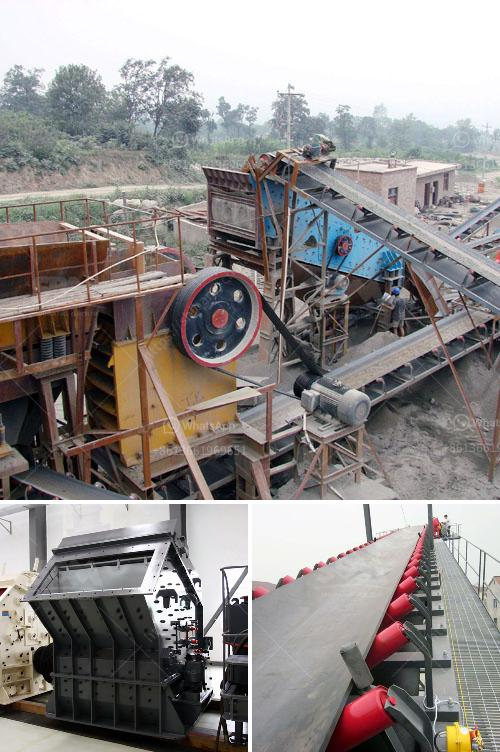

<h3>ykn vibrating screen price</h3>
The YKN vibrating screen, also known as the YK series vibrating screen, is a commonly used equipment in the field of mining, mineral processing, and construction industries. It is widely used for grading and screening materials in the following fields: minerals, quarry, building materials, water conservancy, and hydropower, transportation, chemical industry, smelting, and so on.

As a crucial piece of equipment in these industries, the price of the YKN vibrating screen is an important consideration for potential buyers. The price of the YKN vibrating screen varies depending on several factors such as the model, size, production capacity, and the manufacturer.

The price range for the YKN vibrating screen can generally be categorized into three segments. The lower range starts at around $10,000 and can go up to $20,000. The mid-range options are usually priced between $20,000 and $50,000, while the higher range models can have prices exceeding $50,000.

When considering the price, it is essential to take into account the quality and performance of the vibrating screen. High-quality vibrating screens are equipped with advanced technologies that ensure efficient and accurate screening. These features not only improve productivity but also reduce maintenance costs.

Moreover, the reputation and reliability of the manufacturer also play a significant role in determining the price of the YKN vibrating screen. Established manufacturers with a proven track record often charge a premium for their equipment due to their reliability, durability, and after-sales service.

It is advisable to conduct thorough research and compare prices from different manufacturers before making a final decision. Customers should also consider their specific requirements, such as production capacity and material properties, while evaluating the price.

In conclusion, the YKN vibrating screen is a valuable piece of equipment that plays an important role in various industries. The price of the YKN vibrating screen can range from $10,000 to over $50,000, depending on factors such as model, size, capacity, and manufacturer. Buyers should carefully assess their specific needs and consider the reputation of the manufacturer while evaluating the price. Investing in a high-quality vibrating screen ensures efficient screening and improves overall productivity in the long run.
<h3>Contact us</h3><ul><li><strong>Whatsapp:&nbsp;<a href="https://wa.me/8613661969651">+8613661969651</a></strong></li><li><a href="https://swt.shibang-china.com/?git&amp;zhl&amp;ykn vibrating screen price"><strong>Online Service(chat now)</strong></a></li></ul><h3>Related</h3><ul><li><a href='simple stone crusher dubai.md'>simple stone crusher dubai</a></li><li><a href='coal crushing and screening plant for sale.md'>coal crushing and screening plant for sale</a></li><li><a href='crusher mobile crusher peru.md'>crusher mobile crusher peru</a></li><li><a href='rock pulverizer for manufacturing.md'>rock pulverizer for manufacturing</a></li><li><a href='copper ore concentration plant supplier.md'>copper ore concentration plant supplier</a></li></ul>