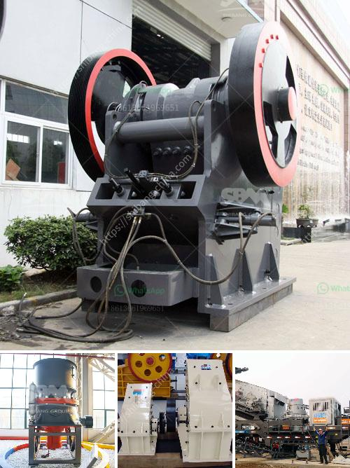

<h3>zimbabwe hammer mills</h3>
By definition, a hammer mill is a mill that breaks down materials into small, fine pieces by the repeated blows of hammers. These machines have various applications in both industry and agriculture. In Zimbabwe, they are mainly used to grind maize, sorghum, soybean meal, and other materials to obtain products such as maize meal, flour, and livestock feed.

The use of hammer mills originated in the early 19th century, initially being powered by water wheels or steam engines. Over time, these devices have evolved to become more efficient and accessible. Nowadays, most hammer mills in Zimbabwe are powered by electricity, making them easy to install and use even in rural areas with limited access to grid power.

One of the primary benefits of using hammer mills in Zimbabwe is that they eliminate the need for industrial-scale milling equipment like dehullers and roller mills. These machines are often expensive and require significant maintenance and expertise to operate effectively. On the other hand, hammer mills are relatively affordable and versatile, making them a popular choice for small-scale and subsistence farmers in the country.

For maize farmers in Zimbabwe, hammer mills play a crucial role in processing maize into mealie meal, a staple food consumed by millions. The maize is first poured into a hopper, where it is gravity-fed into the grinding chamber. Inside the chamber, rotating hammers strike the maize, breaking it down into small particles. The ground maize then passes through a sieve that separates the coarser particles from the finer ones. The final product, known as mealie meal, is a key ingredient in preparing various traditional dishes such as sadza, a porridge-like dish widely enjoyed in Zimbabwe.

In addition to maize, hammer mills in Zimbabwe are also used to grind soybean meal, sorghum, and other crops for animal feed. Livestock farmers often require finely ground feed to ensure their animals receive all the necessary nutrients for optimal growth and production. Hammer mills enable these farmers to process their own feed, lowering costs and improving the overall quality of the livestock diet.

The availability of affordable hammer mills in Zimbabwe has significantly contributed to food security, particularly in rural areas where subsistence farming is prevalent. These mills empower small-scale farmers to process their crops locally, reducing the need to transport raw materials to distant milling facilities and purchase expensive processed products.

Furthermore, the use of hammer mills supports local entrepreneurship. Many rural communities in Zimbabwe have established small-scale milling businesses, creating job opportunities and stimulating economic growth at a local level. These businesses not only supply the local demand for maize meal and other processed commodities but also generate income through the sale of surplus products to neighboring areas.

In conclusion, hammer mills have become indispensable tools for small-scale farmers in Zimbabwe, offering a cost-effective and efficient way to process maize, sorghum, and soybean meal. These machines play a crucial role in ensuring food security and promoting local entrepreneurship. With ongoing technological advancements, the future of hammer mills in Zimbabwe looks promising, as they continue to contribute to the development of the agricultural sector in the country.
<h3>Contact us</h3><ul><li><strong>Whatsapp:&nbsp;<a href="https://wa.me/8613661969651">+8613661969651</a></strong></li><li><a href="https://swt.shibang-china.com/?git&amp;zhl&amp;zimbabwe hammer mills"><strong>Online Service(chat now)</strong></a></li></ul><h3>Related</h3><ul><li><a href='costruire une machine pour broyer des briques.md'>costruire une machine pour broyer des briques</a></li><li><a href='italy stone crusher manufacter.md'>italy stone crusher manufacter</a></li><li><a href='quarry crusher plant location in malaysia.md'>quarry crusher plant location in malaysia</a></li><li><a href='work method statement for jaw crusher.md'>work method statement for jaw crusher</a></li><li><a href='orifice of coal mill machine.md'>orifice of coal mill machine</a></li></ul>