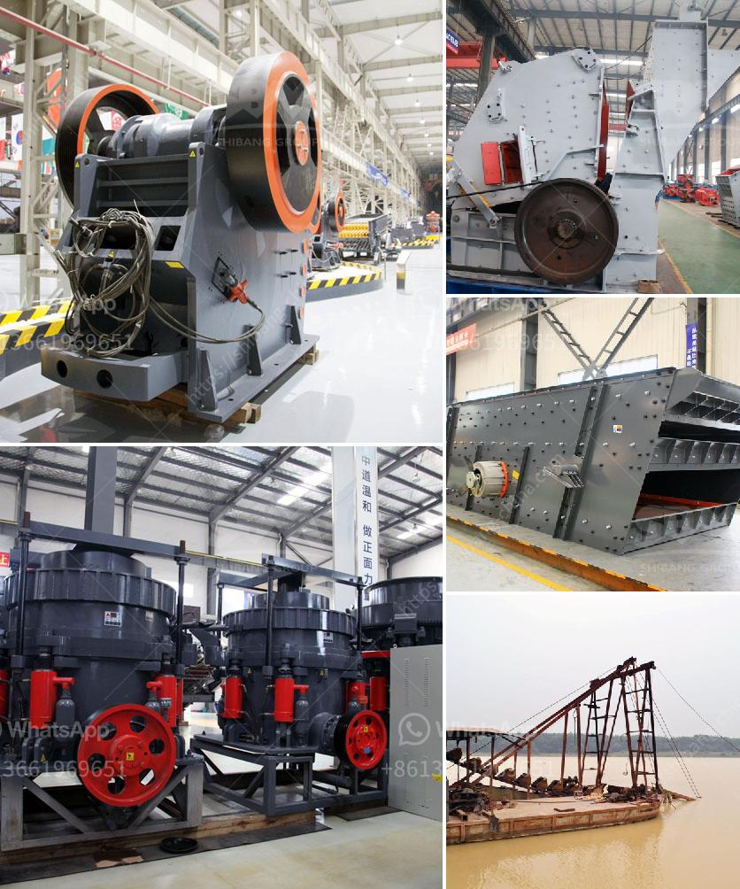

<h3>zinc ore suppliers in south africa</h3>
South Africa has a rich resource base of zinc ore, which is one of the primary minerals used in various industrial applications. It is no wonder that the country is a key player in the global zinc market. South Africa's zinc reserves are estimated to be around 15 million metric tons.

Zinc ore, also known as sphalerite, is a mineral that is the primary source of zinc. Zinc is often used in galvanizing steel, a process that protects the metal from rust and corrosion, making it an essential material for construction and infrastructure projects. Additionally, zinc is used in the production of brass and bronze alloys, as well as in the manufacturing of batteries and electrical equipment.

South Africa is home to several prominent zinc ore suppliers who play a significant role in meeting the global demand for this mineral. These suppliers are responsible for mining, processing, and exporting zinc ore to different parts of the world.

One of the leading zinc ore suppliers in South Africa is Vedanta Zinc International (VZI), a subsidiary of Vedanta Limited, a global diversified natural resources company. VZI operates the Black Mountain Mine, located in the Northern Cape province of South Africa. The mine has been in operation for over 20 years and has a production capacity of around 3,000 metric tons of zinc per month.

Another prominent zinc ore supplier in South Africa is Exxaro Resources Limited. Exxaro is a diversified mining company with operations in various commodities, including zinc. The company operates the Zincor refinery in Gauteng, which has a production capacity of around 110,000 metric tons of zinc per annum. Exxaro's zinc products are used in the manufacturing of galvanized steel, alloys, and chemicals.

Besides VZI and Exxaro, there are other zinc ore suppliers in South Africa, such as African Rainbow Minerals Limited (ARM) and Orion Minerals, which are actively involved in the zinc mining industry. ARM is a mining and minerals company that operates the Nkomati Nickel and Chrome Mine in Mpumalanga. The mine also produces a significant amount of zinc as a by-product.

Orion Minerals, on the other hand, is a mineral exploration company that is currently developing the Prieska Zinc-Copper Project in the Northern Cape. Once operational, this project is expected to become a significant zinc and copper producer, further solidifying South Africa's position in the global zinc market.

The importance of zinc ore suppliers in South Africa extends beyond the local industry. With the country being a key player in the global zinc market, these suppliers play a vital role in meeting the global demand for zinc and its derivatives. Moreover, the mining industry contributes significantly to South Africa's economy, providing employment opportunities and generating revenue for the government.

In conclusion, South Africa is a significant player in the zinc market, thanks to its abundant zinc reserves. Zinc ore suppliers in the country, such as Vedanta Zinc International, Exxaro Resources Limited, and others, are responsible for mining, processing, and exporting zinc ore to meet the global demand. South Africa's involvement in the zinc market contributes to the country's economy, highlighting the importance of this industry and the suppliers that operate within it.
<h3>Contact us</h3><ul><li><strong>Whatsapp:&nbsp;<a href="https://wa.me/8613661969651">+8613661969651</a></strong></li><li><a href="https://swt.shibang-china.com/?git&amp;zhl&amp;zinc ore suppliers in south africa"><strong>Online Service(chat now)</strong></a></li></ul><h3>Related</h3><ul><li><a href='gravel crushers machine.md'>gravel crushers machine</a></li><li><a href='cost of setting up a production plant for tantalum.md'>cost of setting up a production plant for tantalum</a></li><li><a href='portable crushers sweden.md'>portable crushers sweden</a></li><li><a href='ft standard cone crusher pdf.md'>ft standard cone crusher pdf</a></li><li><a href='sand making machine indonesia.md'>sand making machine indonesia</a></li></ul>